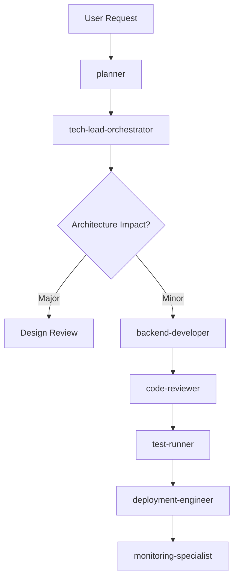
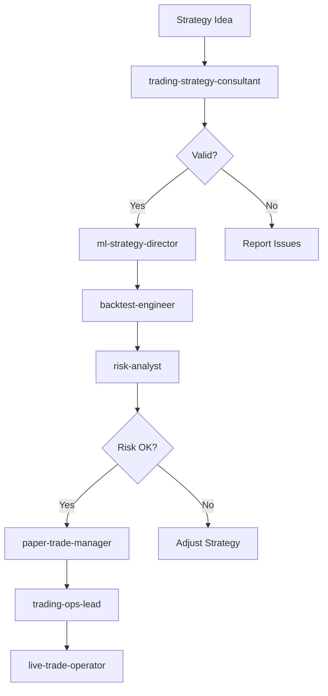
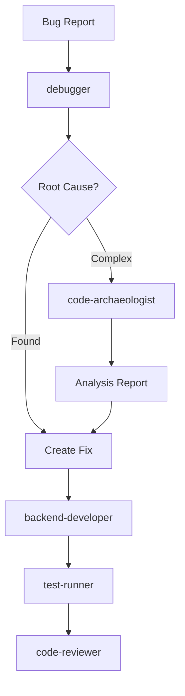
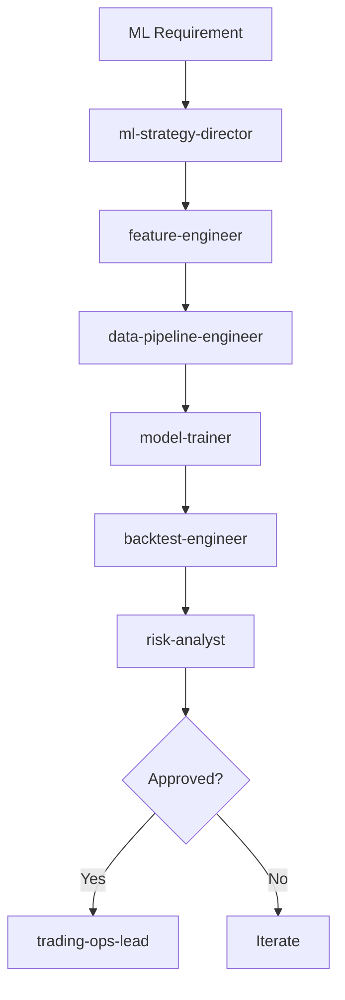
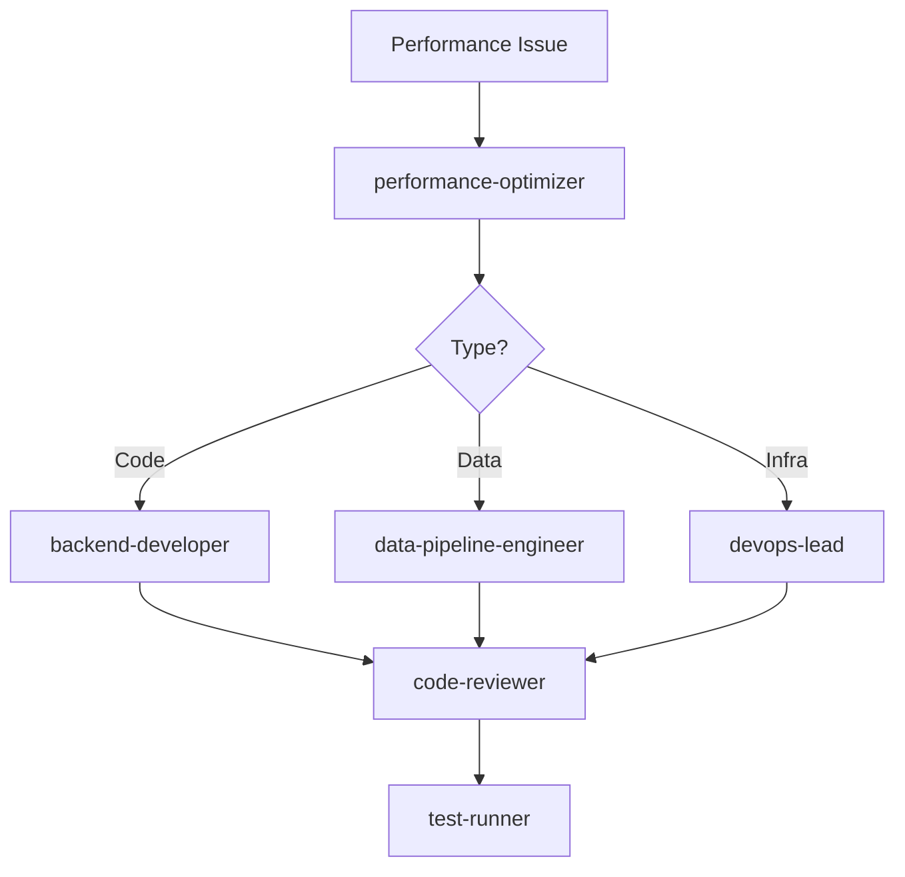

# ⚠️ DEPRECATED KNOWLEDGE LAYER

**This directory contains outdated information from August 2024.**

The project has migrated from Alpaca/Equities to Coinbase/Perpetuals.

**For current documentation, see: [docs/README.md](../docs/README.md)**

---

# 🔄 Agent Delegation Workflows

## Core Delegation Principles

### 1. Single Responsibility
Each agent owns ONE primary domain. They delegate outside their expertise.

### 2. Hierarchical Escalation
Issues escalate up, work flows down:
```
Strategic → Operational → Implementation → Validation
```

### 3. Parallel When Possible
Independent tasks run simultaneously to maximize efficiency.

## Standard Workflows

### 🚀 New Feature Development



**Delegation Chain:**
1. **planner**: Creates 8-step implementation plan
2. **tech-lead-orchestrator**: Reviews architecture impact
3. **backend-developer**: Implements feature
4. **code-reviewer**: Quality assurance
5. **test-runner**: Validation
6. **deployment-engineer**: Production release
7. **monitoring-specialist**: Post-deployment monitoring

### 📈 New Trading Strategy



**Delegation Chain:**
1. **trading-strategy-consultant**: Validates logic and assumptions
2. **ml-strategy-director**: Designs ML components if needed
3. **backtest-engineer**: Historical validation
4. **risk-analyst**: Risk assessment
5. **paper-trade-manager**: Simulation testing
6. **trading-ops-lead**: Production preparation
7. **live-trade-operator**: Live deployment

### 🐛 Bug Investigation



**Delegation Chain:**
1. **debugger**: Localizes issue
2. **code-archaeologist**: Deep analysis if needed
3. **backend-developer**: Implements fix
4. **test-runner**: Validates fix
5. **code-reviewer**: Approves changes

### 🤖 ML Model Development



**Delegation Chain:**
1. **ml-strategy-director**: Designs approach
2. **feature-engineer**: Creates features
3. **data-pipeline-engineer**: Prepares data
4. **model-trainer**: Trains models
5. **backtest-engineer**: Validates performance
6. **risk-analyst**: Assesses risk
7. **trading-ops-lead**: Deploys to production

### 🔧 System Optimization



**Delegation Chain:**
1. **performance-optimizer**: Identifies bottlenecks
2. **Specialized developer**: Implements optimization
3. **code-reviewer**: Reviews changes
4. **test-runner**: Validates improvements

## Parallel Execution Patterns

### Simultaneous Analysis
When analyzing a system, these agents work in parallel:
```python
parallel_agents = [
    "code-archaeologist",    # Code analysis
    "trading-strategy-consultant",  # Strategy review
    "risk-analyst",          # Risk assessment
    "performance-optimizer"  # Performance check
]
```

### Parallel Development
Different components developed simultaneously:
```python
parallel_development = [
    "frontend-developer",    # UI work
    "backend-developer",     # API work
    "data-pipeline-engineer" # Data work
]
```

### Parallel Testing
Multiple test types run concurrently:
```python
parallel_testing = [
    "test-runner",          # Unit tests
    "adversarial-dummy",    # Edge cases
    "backtest-engineer"     # Historical validation
]
```

## Decision Points & Escalation

### When to Escalate

| Situation | Escalate To | Reason |
|-----------|------------|--------|
| Architecture change | tech-lead-orchestrator | System-wide impact |
| Risk limit breach | risk-analyst → trading-ops-lead | Immediate action needed |
| Production issue | devops-lead | Infrastructure expertise |
| Strategy conflict | trading-strategy-consultant | Domain expertise |
| ML model drift | ml-strategy-director | Specialized knowledge |
| Security concern | code-reviewer → devops-lead | Security priority |

### Veto Powers

Certain agents can block progress:
- **risk-analyst**: Can halt any strategy or trade
- **trading-strategy-consultant**: Can reject strategy logic
- **tech-lead-orchestrator**: Can block architecture changes
- **devops-lead**: Can prevent deployments
- **code-reviewer**: Can reject code changes

## Communication Protocols

### Status Updates
```markdown
## Agent Status Report
Agent: [name]
Task: [description]
Status: [in_progress/blocked/complete]
Dependencies: [waiting on X]
Next: [planned action]
ETA: [completion estimate]
```

### Handoff Format
```markdown
## Task Handoff
From: [agent_name]
To: [agent_name]
Task: [description]
Context: [background info]
Deliverables: [expected outputs]
Deadline: [if applicable]
Priority: [critical/high/normal/low]
```

### Escalation Format
```markdown
## Escalation Request
Escalating Agent: [name]
Issue: [description]
Attempted Solutions: [what was tried]
Impact: [consequences]
Recommendation: [suggested action]
Decision Needed: [specific question]
```

## Workflow Automation

### Trigger Conditions

| Event | Triggered Workflow | First Responder |
|-------|-------------------|-----------------|
| Code commit | CI/CD pipeline | test-runner |
| Test failure | Bug investigation | debugger |
| Performance degradation | Optimization | performance-optimizer |
| Risk breach | Risk mitigation | risk-analyst |
| Model drift | Retraining | ml-strategy-director |
| Data anomaly | Data quality check | data-pipeline-engineer |

### Automated Sequences

```python
# Daily Morning Workflow
1. monitoring-specialist → System health check
2. data-pipeline-engineer → Data quality report
3. risk-analyst → Risk metrics calculation
4. trading-ops-lead → Strategy activation

# Pre-deployment Workflow
1. test-runner → Run test suite
2. code-reviewer → Security scan
3. performance-optimizer → Benchmark check
4. devops-lead → Deployment approval

# Incident Response Workflow
1. monitoring-specialist → Detect issue
2. devops-lead → Assess severity
3. Relevant specialist → Fix issue
4. test-runner → Validate fix
5. devops-lead → Deploy fix
```

## Best Practices

### DO's
✅ Delegate to specialists for their domain
✅ Run independent tasks in parallel
✅ Provide clear context in handoffs
✅ Escalate blockers quickly
✅ Document decisions made

### DON'Ts
❌ Skip specialists to save time
❌ Delegate without context
❌ Create circular dependencies
❌ Ignore veto powers
❌ Proceed without required approvals

## Quick Reference

**For complete agent list:** See `AGENTS.md`
**For organization structure:** See `ORGANIZATION.md`
**For who owns what:** See Quick Reference tables in both files

This workflow ensures efficient collaboration while maintaining quality and safety standards.