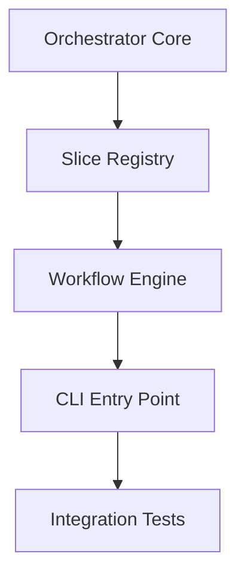

# 📋 EPIC-002.5 Sprint 1: Core Orchestration

**Sprint Name**: System Integration Sprint 1  
**Duration**: 3 days  
**Start Date**: 2025-08-19  
**Objective**: Build fundamental orchestration engine to connect all slices

## 🎯 Sprint 1 Objectives

Transform disconnected slices into a working system by creating:
1. **Core Orchestrator** - Central coordinator for all 11 slices
2. **Slice Registry** - Dynamic discovery and loading
3. **Basic Workflow Engine** - Sequential execution with error handling
4. **Main Entry Point** - CLI interface to run the system

## 👥 Agent Task Assignments

### Task 1: Core Orchestrator Framework (Day 1)
**Lead Agent**: `ml-strategy-director`  
**Support Agent**: `trading-ops-lead`

**Deliverables**:
- `src/bot_v2/orchestration/__init__.py`
- `src/bot_v2/orchestration/orchestrator.py`
- `src/bot_v2/orchestration/types.py`
- `src/bot_v2/orchestration/config.py`

**Key Requirements**:
```python
class TradingOrchestrator:
    """Core orchestration engine"""
    
    def __init__(self, config: OrchestratorConfig):
        # Initialize all 11 slices
        self.data = DataProvider()
        self.analyzer = MarketAnalyzer()
        self.market_regime = RegimeDetector()
        self.ml_strategy = StrategySelector()
        self.position_sizing = PositionSizer()
        self.backtest = Backtester()
        self.paper_trade = PaperTrader()
        self.live_trade = LiveTrader()
        self.monitor = SystemMonitor()
        self.optimizer = Optimizer()
        self.adaptive_portfolio = AdaptiveManager()
    
    def execute_trading_cycle(self, symbol: str) -> TradingResult:
        """Execute one complete trading cycle"""
        # 1. Fetch data
        # 2. Analyze market
        # 3. Detect regime
        # 4. Select strategy
        # 5. Size position
        # 6. Execute trade
        # 7. Monitor results
```

**Delegation Script**:
```
Use ml-strategy-director to create the core orchestration framework that connects all 11 bot_v2 slices.

Context:
- 11 working slices in src/bot_v2/features/
- Each slice is isolated (~500 tokens)
- Slices have no current integration
- Need central coordinator

Requirements:
1. Create orchestration/ directory structure
2. Import all 11 slices successfully
3. Define OrchestratorConfig for settings
4. Implement execute_trading_cycle() method
5. Handle slice initialization errors gracefully
6. Add comprehensive logging
7. Create TradingResult type for outputs

The orchestrator should connect:
- data → analyzer → market_regime → ml_strategy → position_sizing → execution → monitor

Focus on getting basic flow working, optimization comes later.
```

---

### Task 2: Slice Registry & Discovery (Day 1-2)
**Lead Agent**: `data-pipeline-engineer`  
**Support Agent**: `feature-engineer`

**Deliverables**:
- `src/bot_v2/orchestration/registry.py`
- `src/bot_v2/orchestration/adapters.py`
- Updated slice `__init__.py` files for clean interfaces

**Key Requirements**:
```python
class SliceRegistry:
    """Dynamic slice discovery and management"""
    
    def register_slice(self, name: str, slice_class: Type):
        """Register a slice with the orchestrator"""
    
    def get_slice(self, name: str) -> Any:
        """Get initialized slice by name"""
    
    def validate_interfaces(self):
        """Ensure all slices have required methods"""
```

**Delegation Script**:
```
Use data-pipeline-engineer to create slice registry and adapter system.

Context:
- Slices in src/bot_v2/features/ need standardized interfaces
- Some slices may have incompatible method signatures
- Need dynamic loading and discovery

Requirements:
1. Create SliceRegistry class for dynamic management
2. Create adapters for incompatible interfaces
3. Update each slice's __init__.py to expose clean interface:
   - data: get_data(symbol) -> DataFrame
   - analyze: analyze(data) -> AnalysisResult
   - market_regime: detect(data) -> RegimeType
   - ml_strategy: select(context) -> Strategy
   - position_sizing: calculate(context) -> PositionSize
   - backtest: run(strategy, data) -> BacktestResult
   - monitor: log_event(event) -> None
4. Handle missing dependencies gracefully
5. Validate all interfaces at startup
6. Create factory methods for slice creation

Make slices work together without modifying their core logic.
```

---

### Task 3: Basic Workflow Engine (Day 2)
**Lead Agent**: `trading-ops-lead`  
**Support Agent**: `ml-strategy-director`

**Deliverables**:
- `src/bot_v2/workflows/__init__.py`
- `src/bot_v2/workflows/engine.py`
- `src/bot_v2/workflows/definitions.py`
- `src/bot_v2/workflows/context.py`

**Key Requirements**:
```python
class WorkflowEngine:
    """Execute defined trading workflows"""
    
    def execute_workflow(self, workflow_name: str, context: Dict) -> WorkflowResult:
        """Execute a named workflow with context"""
    
    def register_workflow(self, name: str, steps: List[WorkflowStep]):
        """Register a new workflow"""
```

**Example Workflow**:
```yaml
simple_backtest:
  steps:
    - fetch_data: {slice: data, method: get_historical}
    - analyze: {slice: analyze, method: find_patterns}
    - detect_regime: {slice: market_regime, method: detect}
    - select_strategy: {slice: ml_strategy, method: predict_best}
    - size_position: {slice: position_sizing, method: calculate}
    - run_backtest: {slice: backtest, method: execute}
```

**Delegation Script**:
```
Use trading-ops-lead to create workflow engine for orchestrated execution.

Context:
- Orchestrator connects slices but needs workflow definitions
- Different modes (backtest/paper/live) need different workflows
- Need error handling and result aggregation

Requirements:
1. Create WorkflowEngine class
2. Define WorkflowStep and WorkflowResult types
3. Implement sequential step execution
4. Add error handling with graceful degradation
5. Create context passing between steps
6. Define 3 basic workflows:
   - simple_backtest: Historical testing
   - paper_trading: Simulated live trading
   - optimization: Parameter tuning
7. Support workflow configuration via YAML/JSON
8. Add timing and performance metrics
9. Implement result aggregation

Focus on reliability over performance for now.
```

---

### Task 4: Main Entry Point & CLI (Day 3)
**Lead Agent**: `deployment-engineer`  
**Support Agent**: `devops-lead`

**Deliverables**:
- `src/bot_v2/__main__.py`
- `src/bot_v2/cli.py`
- `src/bot_v2/demo.py`
- Updated Docker configuration

**Key Requirements**:
```python
# src/bot_v2/__main__.py
def main():
    parser = argparse.ArgumentParser()
    parser.add_argument('--mode', choices=['backtest', 'paper', 'live'])
    parser.add_argument('--symbols', nargs='+')
    parser.add_argument('--workflow', default='simple_backtest')
    
    args = parser.parse_args()
    
    orchestrator = TradingOrchestrator(config)
    result = orchestrator.run(args.workflow, args.symbols)
    print(result)
```

**Usage Examples**:
```bash
# Run backtest
python -m bot_v2 --mode backtest --symbols AAPL MSFT

# Run paper trading
python -m bot_v2 --mode paper --workflow paper_trading

# Run optimization
python -m bot_v2 --mode optimize --symbols AAPL
```

**Delegation Script**:
```
Use deployment-engineer to create main entry point and CLI for bot_v2.

Context:
- Orchestrator exists but needs user interface
- Docker needs main process to run
- Users need simple commands

Requirements:
1. Create __main__.py as entry point
2. Create CLI with argparse:
   - --mode: backtest/paper/live/optimize
   - --symbols: List of symbols to trade
   - --workflow: Named workflow to execute
   - --config: Config file path
   - --verbose: Debug output
3. Create demo.py showing example usage
4. Update Dockerfile CMD to use new entry point
5. Add --help with clear documentation
6. Handle errors with user-friendly messages
7. Support both CLI and programmatic usage
8. Add basic output formatting (JSON/table)
9. Create shell wrapper script

Make it as simple as: python -m bot_v2 --mode backtest --symbols AAPL
```

---

### Task 5: Integration Testing (Day 3)
**Lead Agent**: `test-runner`  
**Support Agent**: `debugger`

**Deliverables**:
- `tests/integration/bot_v2/test_orchestrator.py`
- `tests/integration/bot_v2/test_workflows.py`
- `tests/integration/bot_v2/test_end_to_end.py`

**Test Requirements**:
- Orchestrator initializes all slices
- Basic workflow executes successfully
- Error handling works correctly
- CLI commands function properly
- Docker container runs

**Delegation Script**:
```
Use test-runner to create comprehensive integration tests for orchestrator.

Requirements:
1. Test orchestrator initialization
2. Test all slice loading
3. Test basic workflow execution
4. Test error scenarios
5. Test CLI commands
6. Create end-to-end test
7. Verify Docker integration

Ensure the complete system works together.
```

## 🔄 Task Dependencies



## 📊 Success Metrics

### Day 1 Complete
- [ ] Orchestrator class created and imports all slices
- [ ] Basic trading cycle method implemented
- [ ] Slice registry functioning

### Day 2 Complete  
- [ ] All slice interfaces standardized
- [ ] Workflow engine executing steps
- [ ] Three basic workflows defined

### Day 3 Complete
- [ ] CLI working with all commands
- [ ] Docker container runs successfully
- [ ] Integration tests passing
- [ ] Can run: `python -m bot_v2 --mode backtest --symbols AAPL`

## 💡 Risk Mitigation

| Risk | Mitigation |
|------|------------|
| Slice import failures | Use try/except with fallbacks |
| Interface mismatches | Create adapter layer |
| Circular dependencies | Use lazy imports |
| Performance issues | Profile and optimize in Sprint 4 |

## 🎯 Definition of Done

Sprint 1 is complete when:
1. Can run `python -m bot_v2 --mode backtest --symbols AAPL` successfully
2. All 11 slices are connected and communicating
3. Basic workflows execute without errors
4. Docker container starts and runs
5. Integration tests pass
6. Documentation updated

## 📝 Notes for Agents

### Critical Context
- **Current State**: 11 slices work independently but are NOT connected
- **No existing orchestration**: You're building from scratch
- **Use what exists**: Don't rewrite slices, just connect them
- **Focus on working**: Get basic flow working before optimizing

### File Locations
```
Slices: src/bot_v2/features/*/
Tests: tests/integration/bot_v2/
New orchestration: src/bot_v2/orchestration/
New workflows: src/bot_v2/workflows/
Entry point: src/bot_v2/__main__.py
```

### Testing the Integration
```bash
# After implementation, test with:
cd /Users/rj/PycharmProjects/GPT-Trader
python -m bot_v2 --mode backtest --symbols AAPL --verbose

# Should output something like:
# Loading slices... ✓
# Executing workflow: simple_backtest
# Fetching data for AAPL... ✓
# Analyzing market... ✓
# Detecting regime... ✓
# Selecting strategy... ✓
# Sizing position... ✓
# Running backtest... ✓
# Results: {...}
```

---

**Ready to begin Sprint 1 of EPIC-002.5!** This sprint will transform our disconnected slices into a working trading system.