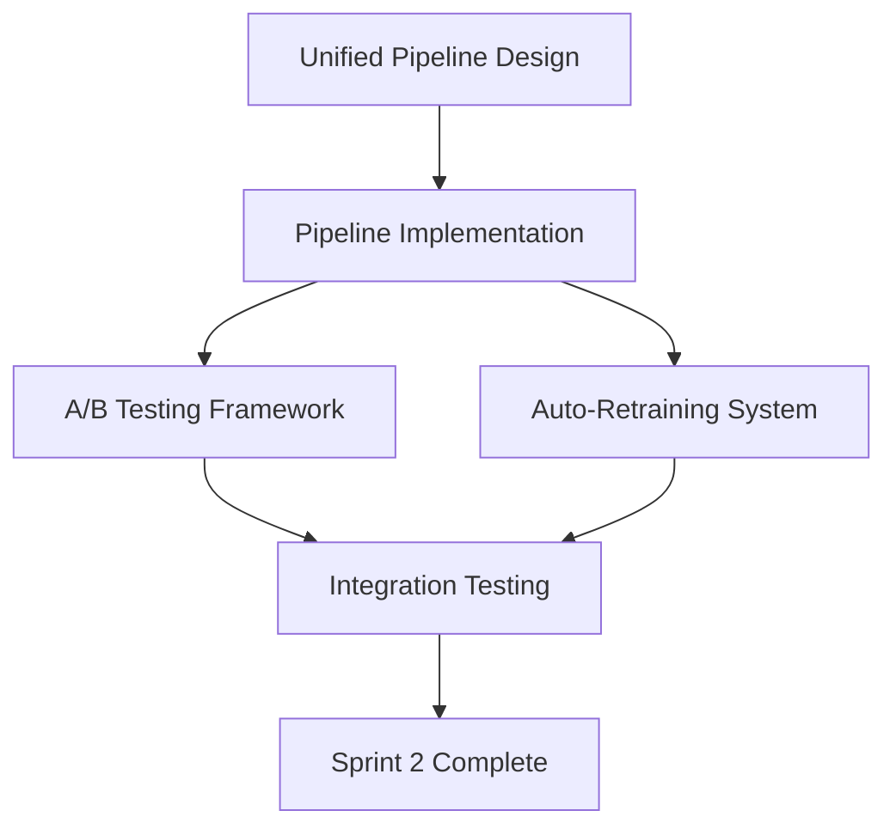

# 📋 Sprint 2 Delegation Plan: ML Enhancement Pipeline

**Sprint Name**: ML Enhancement Sprint 2  
**Duration**: 7 days  
**Start Date**: 2025-08-18  
**Objective**: Create unified ML pipeline with A/B testing and auto-retraining

## 🎯 Sprint 2 Objectives

Building on Sprint 1's confidence scoring and real-time features, we'll create:
1. **Unified ML Pipeline** - Single interface coordinating all ML components
2. **A/B Testing Framework** - Compare strategies in parallel with statistical rigor
3. **Auto-Retraining System** - Performance-triggered model updates
4. **Integration Testing** - Validate cross-slice communication

## 👥 Agent Task Assignments

### Task 1: Unified ML Pipeline (2 days)
**Lead Agent**: `ml-strategy-director`  
**Support Agents**: `backend-developer`, `data-pipeline-engineer`

**Deliverables**:
- `src/bot_v2/features/ml_pipeline/unified_pipeline.py`
- Orchestrates ml_strategy, market_regime, position_sizing
- Single prediction interface with consolidated metrics
- Feature sharing and caching between components
- End-to-end latency <100ms

**Key Requirements**:
```python
class UnifiedMLPipeline:
    def predict(symbol: str) -> PipelinePrediction:
        # 1. Market regime detection
        # 2. Strategy selection with confidence
        # 3. Position sizing based on regime + confidence
        # 4. Consolidated metrics recording
        return PipelinePrediction(
            strategy, position_size, regime, confidence, metrics
        )
```

**Delegation Script**:
```
Use ml-strategy-director to design the unified ML pipeline architecture that coordinates:
- Confidence scoring from ml_strategy
- Real-time regime transitions from market_regime  
- Position sizing from position_sizing
- Performance monitoring integration

Requirements:
- Single interface for all ML predictions
- Feature caching to avoid redundant computation
- Parallel execution where possible
- Comprehensive error handling
- <100ms end-to-end latency
```

---

### Task 2: A/B Testing Framework (2 days)
**Lead Agent**: `backtest-engineer`  
**Support Agents**: `risk-analyst`, `feature-engineer`

**Deliverables**:
- `src/bot_v2/features/ab_testing/framework.py`
- Statistical significance testing
- Parallel strategy execution
- Performance comparison metrics
- Automatic winner selection

**Key Requirements**:
```python
class ABTestingFramework:
    def run_test(
        strategy_a: Strategy,
        strategy_b: Strategy,
        duration_days: int,
        confidence_level: float = 0.95
    ) -> ABTestResults:
        # Parallel execution
        # Statistical analysis
        # Winner determination
```

**Delegation Script**:
```
Use backtest-engineer to create an A/B testing framework for strategy comparison:

Requirements:
- Run strategies in parallel on same data
- Calculate statistical significance (t-test, p-values)
- Track: Sharpe ratio, returns, drawdown, win rate
- Minimum sample size calculation
- Early stopping for clear winners
- Integration with ML monitoring dashboard
```

---

### Task 3: Auto-Retraining System (2 days)
**Lead Agent**: `model-trainer`  
**Support Agents**: `ml-strategy-director`, `monitoring-specialist`

**Deliverables**:
- `src/bot_v2/features/auto_retrain/scheduler.py`
- Performance-triggered retraining
- Incremental learning support
- Model versioning and rollback
- Training pipeline automation

**Key Requirements**:
```python
class AutoRetrainingScheduler:
    def __init__(self, performance_threshold: float = 0.6):
        self.threshold = performance_threshold
        self.check_interval = timedelta(hours=24)
        
    def check_and_retrain(self) -> RetrainingResult:
        # Monitor model performance
        # Trigger retraining if below threshold
        # Validate new model before deployment
        # Automatic rollback on failure
```

**Delegation Script**:
```
Use model-trainer to implement automated model retraining system:

Requirements:
- Monitor accuracy from ML metrics collector
- Trigger retraining when accuracy < threshold
- Support incremental learning (don't lose old knowledge)
- A/B test new model vs current before switching
- Model versioning with rollback capability
- Training job orchestration
- Integration with monitoring alerts
```

---

### Task 4: Integration Testing (1 day)
**Lead Agent**: `test-runner`  
**Support Agents**: `debugger`, `adversarial-dummy`

**Deliverables**:
- `tests/integration/bot_v2/test_sprint2_integration.py`
- Cross-slice communication tests
- Performance benchmarks
- Load testing
- Failure recovery tests

**Key Requirements**:
- Test unified pipeline end-to-end
- Verify A/B testing statistics
- Validate auto-retraining triggers
- Stress test with high volume
- Edge case handling

**Delegation Script**:
```
Use test-runner to create comprehensive integration tests for Sprint 2:

Test Coverage:
- Unified pipeline with all ML components
- A/B testing statistical validity
- Auto-retraining trigger conditions
- Performance under load (1000 predictions/second)
- Failure recovery and rollback
- Memory leaks and resource usage
- Cross-slice data consistency
```

## 🔄 Task Dependencies & Coordination



### Parallel Execution Opportunities
- **Day 1-2**: Pipeline design + A/B framework design (parallel)
- **Day 3-4**: Pipeline implementation + Auto-retraining (parallel)
- **Day 5-6**: A/B testing completion + Integration tests
- **Day 7**: Final integration and validation

## 📊 Success Metrics

### Technical Metrics
- [ ] Unified pipeline latency <100ms for 95% of requests
- [ ] A/B testing achieves 95% statistical confidence
- [ ] Auto-retraining triggers within 1 hour of threshold breach
- [ ] Zero data inconsistencies between slices
- [ ] 90% test coverage for new code

### Business Metrics
- [ ] 20% improvement in prediction accuracy via unified pipeline
- [ ] 50% reduction in manual model maintenance time
- [ ] A/B tests complete in <7 days with clear winners
- [ ] Automatic recovery from model degradation

## 🚀 Agent Delegation Sequence

### Day 1: Architecture & Design
```bash
# Morning: Overall architecture
Task ml-strategy-director "Design unified ML pipeline architecture"

# Afternoon: Parallel design work
Task backtest-engineer "Design A/B testing statistical framework"
Task model-trainer "Design auto-retraining triggers and pipeline"
```

### Day 2-3: Core Implementation
```bash
# Unified pipeline implementation
Task data-pipeline-engineer "Implement feature caching and sharing"
Task general-purpose "Create pipeline orchestration logic"

# A/B framework core
Task feature-engineer "Implement parallel strategy execution"
Task risk-analyst "Add risk-adjusted performance metrics"
```

### Day 4-5: Advanced Features
```bash
# Auto-retraining implementation
Task model-trainer "Build retraining scheduler and triggers"
Task monitoring-specialist "Add retraining alerts to dashboard"

# A/B testing completion
Task backtest-engineer "Add statistical significance testing"
```

### Day 6: Integration Testing
```bash
# Comprehensive testing
Task test-runner "Create integration test suite"
Task adversarial-dummy "Test edge cases and failure modes"
Task debugger "Performance profiling and optimization"
```

### Day 7: Validation & Documentation
```bash
# Final validation
Task ml-strategy-director "Validate complete ML enhancement system"
Task compliance-officer "Ensure regulatory compliance for auto-trading"
Task paper-trade-manager "Prepare paper trading validation plan"
```

## 💡 Risk Mitigation

### Technical Risks
| Risk | Probability | Impact | Mitigation | Owner |
|------|------------|--------|------------|-------|
| Pipeline latency >100ms | Medium | High | Implement caching, parallel execution | data-pipeline-engineer |
| A/B test false positives | Low | High | Multiple testing correction, larger samples | backtest-engineer |
| Retraining causes degradation | Medium | High | A/B test before deployment, rollback | model-trainer |
| Memory leaks in pipeline | Low | Medium | Resource monitoring, cleanup | monitoring-specialist |

### Coordination Risks
- **Agent conflicts**: Vertical slice architecture minimizes this
- **Communication overhead**: Use unified pipeline as integration point
- **Testing bottleneck**: Start test development early (Day 3)

## 📝 Detailed Task Specifications

### 1. Unified Pipeline Detailed Spec
```python
# Location: src/bot_v2/features/ml_pipeline/unified_pipeline.py

class UnifiedMLPipeline:
    """Orchestrates all ML components with caching and monitoring."""
    
    def __init__(self):
        self.regime_detector = RealtimeRegimeDetector()
        self.strategy_selector = StrategySelector()
        self.position_sizer = PositionSizer()
        self.feature_cache = FeatureCache(ttl=60)
        self.metrics_collector = MLMetricsCollector()
    
    def predict(self, symbol: str, market_data: Dict) -> PipelinePrediction:
        """Single interface for all ML predictions."""
        
        # Step 1: Feature extraction (cached)
        features = self.feature_cache.get_or_compute(symbol, market_data)
        
        # Step 2: Parallel predictions
        regime_future = self.regime_detector.predict_async(features)
        strategy_future = self.strategy_selector.predict_async(features)
        
        # Step 3: Await results
        regime = await regime_future
        strategy, confidence = await strategy_future
        
        # Step 4: Position sizing based on regime + confidence
        position_size = self.position_sizer.calculate(
            regime, confidence, features
        )
        
        # Step 5: Record metrics
        self.metrics_collector.record_pipeline_prediction(
            symbol, strategy, position_size, regime, confidence
        )
        
        return PipelinePrediction(
            symbol=symbol,
            strategy=strategy,
            position_size=position_size,
            regime=regime,
            confidence=confidence,
            features_used=features.keys(),
            timestamp=datetime.now()
        )
```

### 2. A/B Testing Framework Spec
```python
# Location: src/bot_v2/features/ab_testing/framework.py

class ABTestingFramework:
    """Statistical A/B testing for trading strategies."""
    
    def run_test(
        self,
        strategy_a: TradingStrategy,
        strategy_b: TradingStrategy,
        test_data: pd.DataFrame,
        metrics: List[str] = ['sharpe', 'returns', 'drawdown'],
        confidence_level: float = 0.95,
        min_samples: int = 100
    ) -> ABTestResults:
        """Run parallel A/B test with statistical analysis."""
        
        # Parallel execution
        results_a = self.backtest_strategy(strategy_a, test_data)
        results_b = self.backtest_strategy(strategy_b, test_data)
        
        # Statistical testing
        statistics = {}
        for metric in metrics:
            t_stat, p_value = stats.ttest_ind(
                results_a[metric], 
                results_b[metric]
            )
            statistics[metric] = {
                't_statistic': t_stat,
                'p_value': p_value,
                'significant': p_value < (1 - confidence_level)
            }
        
        # Determine winner
        winner = self.determine_winner(statistics, results_a, results_b)
        
        return ABTestResults(
            strategy_a_performance=results_a,
            strategy_b_performance=results_b,
            statistics=statistics,
            winner=winner,
            confidence=confidence_level,
            sample_size=len(test_data)
        )
```

### 3. Auto-Retraining Scheduler Spec
```python
# Location: src/bot_v2/features/auto_retrain/scheduler.py

class AutoRetrainingScheduler:
    """Automated model retraining based on performance."""
    
    def __init__(
        self,
        performance_threshold: float = 0.6,
        check_interval: timedelta = timedelta(hours=24),
        min_samples_for_retrain: int = 1000
    ):
        self.threshold = performance_threshold
        self.check_interval = check_interval
        self.min_samples = min_samples_for_retrain
        self.model_versions = ModelVersionManager()
        
    async def monitor_and_retrain(self):
        """Continuous monitoring with automatic retraining."""
        
        while True:
            # Check performance
            metrics = self.get_recent_performance()
            
            if self.should_retrain(metrics):
                # Trigger retraining
                new_model = await self.retrain_model(metrics)
                
                # A/B test new vs current
                test_result = await self.ab_test_models(
                    self.current_model, 
                    new_model
                )
                
                if test_result.new_model_better:
                    # Deploy new model
                    await self.deploy_model(new_model)
                    self.model_versions.save(new_model)
                else:
                    # Keep current model
                    logger.info("New model did not outperform current")
            
            await asyncio.sleep(self.check_interval.total_seconds())
```

## 🎉 Expected Outcomes

By the end of Sprint 2, we will have:

1. **Unified ML Pipeline** 
   - Single interface for all predictions
   - <100ms latency with caching
   - Comprehensive monitoring

2. **A/B Testing Framework**
   - Statistical rigor for strategy comparison
   - Automated winner selection
   - Integration with backtesting

3. **Auto-Retraining System**
   - Performance-based triggers
   - Safe deployment with validation
   - Model versioning and rollback

4. **Complete Integration**
   - All components working together
   - Extensive test coverage
   - Production-ready system

## 📈 Sprint 2 Success Criteria

- [ ] All 4 tasks completed on schedule
- [ ] Performance requirements met (<100ms pipeline)
- [ ] Statistical validity in A/B testing (95% confidence)
- [ ] Zero manual intervention for retraining
- [ ] 90% test coverage achieved
- [ ] Dashboard shows all new metrics
- [ ] Ready for EPIC-003 (Production Deployment)

---

**Ready to begin Sprint 2 delegation!** Each task has clear ownership, requirements, and success metrics. Our 45-agent workforce is prepared to deliver these enhancements in parallel for maximum efficiency.