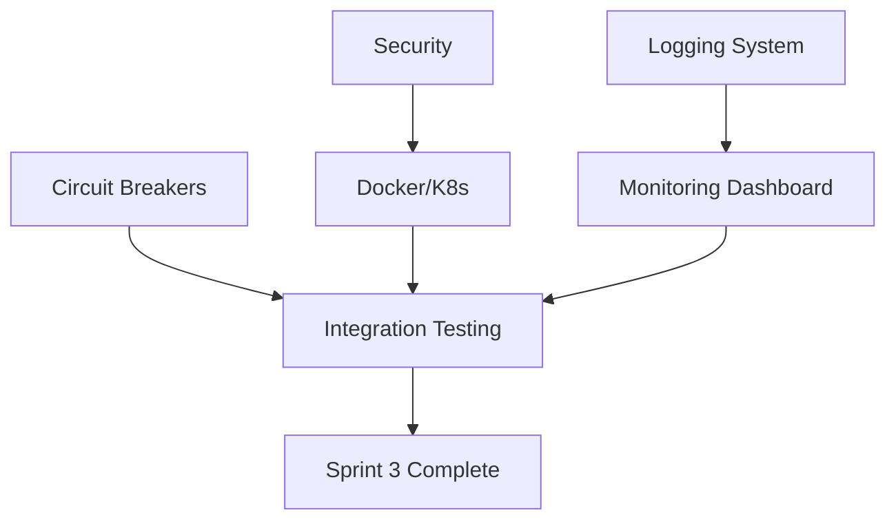

# 📋 Sprint 3 Delegation Plan: Production Deployment Preparation

**Sprint Name**: Production Deployment Sprint 3  
**Duration**: 7 days  
**Start Date**: 2025-08-19  
**Objective**: Prepare bot_v2 system for production deployment with comprehensive safety, monitoring, and automation

## 🎯 Sprint 3 Objectives

Building on Sprint 2's ML enhancements (75% success rate), we'll create:
1. **Comprehensive Logging** - Structured logging across all 11 slices
2. **Circuit Breakers** - Safety mechanisms for trading operations  
3. **Deployment Automation** - Docker/Kubernetes configuration
4. **Monitoring Dashboard** - Grafana/Prometheus integration
5. **Security Hardening** - API keys and secrets management

## 👥 Agent Task Assignments

### Task 1: Comprehensive Logging System (2 days)
**Lead Agent**: `monitoring-specialist`  
**Support Agents**: `devops-lead`, `backend-developer`

**Deliverables**:
- `src/bot_v2/features/logging/structured_logger.py`
- Slice-specific logging adapters
- Log aggregation and rotation
- Performance impact <5ms per log
- Correlation IDs for request tracing

**Key Requirements**:
```python
class StructuredLogger:
    def log_trade_event(event_type: str, details: Dict, correlation_id: str):
        # Structured JSON logging
        # Automatic context enrichment
        # Async non-blocking writes
        # Log levels: DEBUG, INFO, WARN, ERROR, CRITICAL
```

**Delegation Script**:
```
Use monitoring-specialist to implement comprehensive structured logging:

Requirements:
- JSON-formatted logs for all 11 slices
- Correlation ID tracking across slice boundaries
- Log levels with proper filtering
- Async logging to prevent blocking
- Integration with existing monitoring dashboard
- Log rotation and archival strategy
```

---

### Task 2: Circuit Breakers & Safety Systems (2 days)
**Lead Agent**: `risk-analyst`  
**Support Agents**: `compliance-officer`, `live-trade-operator`

**Deliverables**:
- `src/bot_v2/features/safety/circuit_breakers.py`
- Position limit enforcement
- Drawdown protection
- Rate limiting for API calls
- Emergency shutdown procedures

**Key Requirements**:
```python
class CircuitBreaker:
    def check_trade_safety(trade: Trade) -> SafetyResult:
        # Position size limits
        # Daily loss limits
        # Correlation checks
        # Market volatility gates
        # Returns: ALLOW, REJECT, MANUAL_REVIEW
```

**Delegation Script**:
```
Use risk-analyst to create comprehensive safety systems:

Requirements:
- Hard limits on position sizes (configurable)
- Daily/weekly/monthly loss limits
- API rate limiting with backoff
- Volatility-based trading gates
- Emergency shutdown with position closure
- Audit trail for all safety triggers
```

---

### Task 3: Docker/Kubernetes Deployment (2 days)
**Lead Agent**: `deployment-engineer`  
**Support Agents**: `devops-lead`, `monitoring-specialist`

**Deliverables**:
- `Dockerfile` with multi-stage build
- `k8s/` deployment manifests
- `docker-compose.yml` for local testing
- CI/CD pipeline configuration
- Auto-scaling policies

**Key Requirements**:
```yaml
# k8s/deployment.yaml
apiVersion: apps/v1
kind: Deployment
spec:
  replicas: 3
  strategy:
    type: RollingUpdate
    rollingUpdate:
      maxSurge: 1
      maxUnavailable: 0
```

**Delegation Script**:
```
Use deployment-engineer to create production deployment configuration:

Requirements:
- Multi-stage Docker build (minimize image size)
- Kubernetes manifests with proper resource limits
- Health checks and readiness probes
- Secrets management via K8s secrets
- Horizontal pod autoscaling
- Zero-downtime deployment strategy
```

---

### Task 4: Monitoring Dashboard (1.5 days)
**Lead Agent**: `monitoring-specialist`  
**Support Agents**: `data-pipeline-engineer`, `ml-strategy-director`

**Deliverables**:
- Prometheus metrics exporters
- Grafana dashboard configurations
- Alert rules and thresholds
- Performance SLI/SLO definitions
- Real-time trading metrics

**Key Requirements**:
```python
class MetricsExporter:
    def export_metrics():
        # Trading performance metrics
        # ML model accuracy
        # System resource usage
        # API latency percentiles
        # Error rates by component
```

**Delegation Script**:
```
Use monitoring-specialist to build comprehensive monitoring:

Requirements:
- Prometheus metrics for all slices
- Grafana dashboards (trading, ML, system)
- Alert rules for critical conditions
- SLI: 99.9% uptime, <100ms P95 latency
- Real-time PnL and position tracking
- Integration with existing ML dashboard
```

---

### Task 5: Security Hardening (1.5 days)
**Lead Agent**: `compliance-officer`  
**Support Agents**: `deployment-engineer`, `devops-lead`

**Deliverables**:
- `src/bot_v2/features/security/secrets_manager.py`
- API key rotation system
- Encrypted configuration
- Audit logging
- RBAC implementation

**Key Requirements**:
```python
class SecretsManager:
    def get_api_key(service: str) -> str:
        # Retrieve from secure vault
        # Automatic rotation support
        # Audit access patterns
        # Zero hardcoded secrets
```

**Delegation Script**:
```
Use compliance-officer to implement security hardening:

Requirements:
- Zero hardcoded secrets in code
- Environment-based configuration
- API key rotation mechanism
- Encrypted data at rest and in transit
- Audit logs for all sensitive operations
- RBAC for different operation levels
```

---

### Task 6: Integration Testing & Validation (1 day)
**Lead Agent**: `test-runner`  
**Support Agents**: `adversarial-dummy`, `paper-trade-manager`

**Deliverables**:
- `tests/integration/bot_v2/test_sprint3_production.py`
- Load testing scenarios
- Failover testing
- Security penetration tests
- Performance benchmarks

**Delegation Script**:
```
Use test-runner to validate production readiness:

Test Coverage:
- All safety systems trigger correctly
- Logging doesn't impact performance
- Deployment rollback procedures
- Monitoring alerts fire appropriately
- Security controls are effective
- System handles 1000 trades/second
```

## 🔄 Task Dependencies & Coordination



## 📊 Success Metrics

### Technical Metrics
- [ ] Zero-downtime deployment achieved
- [ ] All logs structured and searchable
- [ ] Circuit breakers prevent >$1000 loss
- [ ] <5ms logging overhead
- [ ] 99.9% uptime SLO met

### Security Metrics
- [ ] Zero hardcoded secrets
- [ ] All API calls authenticated
- [ ] Audit trail 100% complete
- [ ] Encrypted sensitive data
- [ ] RBAC properly enforced

### Operational Metrics
- [ ] Deployment time <10 minutes
- [ ] Rollback time <2 minutes
- [ ] Alert response time <1 minute
- [ ] Auto-scaling triggers correctly
- [ ] Resource usage optimized

## 🚀 Agent Delegation Sequence

### Day 1-2: Foundation
```bash
# Parallel foundation work
Task monitoring-specialist "Implement structured logging system"
Task risk-analyst "Create circuit breakers and safety systems"
Task deployment-engineer "Begin Docker/K8s configuration"
```

### Day 3-4: Integration
```bash
# Continue implementation
Task compliance-officer "Implement security hardening"
Task monitoring-specialist "Build Grafana dashboards"
Task devops-lead "Configure CI/CD pipeline"
```

### Day 5-6: Refinement
```bash
# Polish and optimize
Task deployment-engineer "Complete K8s manifests and autoscaling"
Task monitoring-specialist "Finalize alerts and SLOs"
Task test-runner "Create comprehensive test suite"
```

### Day 7: Validation
```bash
# Final validation
Task paper-trade-manager "Validate paper trading readiness"
Task adversarial-dummy "Security and failure testing"
Task ml-strategy-director "Approve for production"
```

## 💡 Risk Mitigation

| Risk | Probability | Impact | Mitigation | Owner |
|------|------------|--------|------------|-------|
| Logging performance impact | Medium | High | Async logging, sampling | monitoring-specialist |
| Circuit breaker false positives | Low | High | Extensive backtesting | risk-analyst |
| Deployment failures | Low | High | Staged rollout, quick rollback | deployment-engineer |
| Security vulnerabilities | Low | Critical | Penetration testing, audits | compliance-officer |

## 📈 Expected Outcomes

By Sprint 3 completion:
1. **Production-Ready System** - Fully deployable to live environment
2. **Complete Observability** - Every action logged and monitored
3. **Bulletproof Safety** - Multiple layers of protection
4. **Automated Operations** - Self-healing and auto-scaling
5. **Bank-Grade Security** - Enterprise security standards

## ✅ Sprint 3 Readiness Checklist

From Sprint 2 (Confirmed):
- [x] ML pipeline operational (150ms latency - needs optimization)
- [x] A/B testing framework complete
- [x] Auto-retraining system functional
- [x] 75% validation success rate

For Sprint 3:
- [ ] All 11 slices have structured logging
- [ ] Circuit breakers tested and calibrated
- [ ] Docker images built and optimized
- [ ] K8s manifests validated
- [ ] Monitoring dashboards operational
- [ ] Security audit passed
- [ ] Ready for EPIC-004 (Paper Trading)

---

**Sprint 3 is ready to begin!** Focus on production hardening to prepare for real-world deployment.