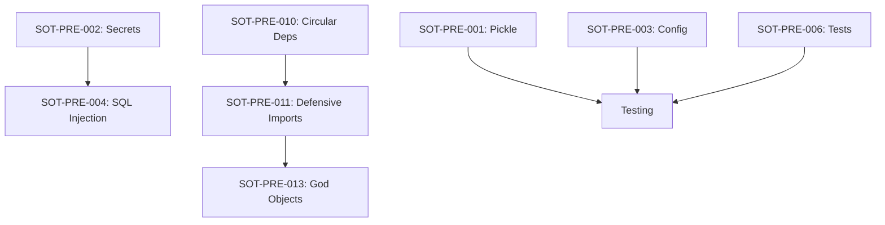

# Phase 2.5: Foundation Fixes - Detailed Sub-Task Breakdown
*Generated: 2025-08-14*

## Overview
Phase 2.5 addresses critical issues discovered in the second-pass audit before proceeding to SoT automation. This document provides detailed sub-tasks for complex items requiring breakdown.

## Tasks Requiring Sub-Tasks

### 🔴 HIGH COMPLEXITY (12-16 hours each)

#### SOT-PRE-001: Remove ALL Pickle Usage [12 hours]
**Owner**: python-pro
**Risk**: HIGH - Data loss if improperly migrated

##### Sub-Tasks:
- [ ] **001.1** - Audit & Inventory (2h)
  - Scan all 21 files with pickle usage
  - Document serialized data types
  - Create compatibility matrix

- [ ] **001.2** - Migration Strategy (1h)
  - Select replacements (joblib for ML, JSON for data)
  - Design migration utilities
  - Document rollback plan

- [ ] **001.3** - Core Migrations (4h)
  - `ml/model_versioning.py` (3 instances)
  - `risk/anomaly_detector.py` (3 instances)
  - `ml/reinforcement_learning/q_learning.py` (7 instances)

- [ ] **001.4** - Remaining Migrations (3h)
  - Convert 18 remaining files
  - Update all imports
  - Remove pickle from requirements

- [ ] **001.5** - Testing & Validation (2h)
  - Test serialization round-trips
  - Benchmark performance impact
  - Verify backward compatibility

---

#### SOT-PRE-003: Consolidate Configuration [12 hours]
**Owner**: backend-developer
**Risk**: HIGH - Application breakage if misconfigured

##### Sub-Tasks:
- [ ] **003.1** - Configuration Audit (2h)
  - Map 5 config modules
  - Document all configuration keys
  - Identify conflicts/overlaps

- [ ] **003.2** - Design Unified Schema (2h)
  - Create consolidated structure
  - Design environment mappings
  - Plan migration path

- [ ] **003.3** - Implement Core Config (3h)
  - Create `src/bot/config/unified.py`
  - Implement env loading
  - Add validation layer

- [ ] **003.4** - Module Migration (4h)
  - Update 21+ file imports
  - Remove old config modules
  - Update documentation

- [ ] **003.5** - Testing & Validation (1h)
  - Test all config paths
  - Verify env loading
  - Check defaults

---

#### SOT-PRE-010: Eliminate Circular Dependencies [16 hours]
**Owner**: refactoring-specialist
**Risk**: HIGH - Import failures if improperly refactored

##### Sub-Tasks:
- [ ] **010.1** - Dependency Analysis (3h)
  - Generate dependency graph
  - Identify circular chains
  - Prioritize by impact

- [ ] **010.2** - Refactoring Plan (2h)
  - Plan module reorganization
  - Design interface boundaries
  - Create migration strategy

- [ ] **010.3** - Core Refactoring (6h)
  - Break circular chains
  - Implement dependency injection
  - Create abstract interfaces

- [ ] **010.4** - Update Imports (4h)
  - Remove defensive patterns
  - Update all affected imports
  - Test import chains

- [ ] **010.5** - Validation (1h)
  - Run cycle detection
  - Verify no circular deps
  - Performance testing

---

#### SOT-PRE-013: Break Up God Objects [14 hours]
**Owner**: refactoring-specialist
**Risk**: MEDIUM - Functionality regression

##### Sub-Tasks:
- [ ] **013.1** - Code Analysis (2h)
  - Analyze `core/analytics.py` (1,407 lines)
  - Analyze `core/observability.py` (1,278 lines)
  - Identify logical boundaries

- [ ] **013.2** - Design Decomposition (2h)
  - Plan module splits
  - Design interfaces
  - Create migration plan

- [ ] **013.3** - Refactor analytics.py (4h)
  - Split into 3-4 modules
  - Maintain compatibility
  - Update imports

- [ ] **013.4** - Refactor observability.py (4h)
  - Split into 3-4 modules
  - Maintain compatibility
  - Update imports

- [ ] **013.5** - Testing & Integration (2h)
  - Test functionality
  - Verify no regressions
  - Update documentation

---

### 🟠 MEDIUM COMPLEXITY (6-9 hours each)

#### SOT-PRE-006: Consolidate Test Organization [6 hours]
**Owner**: repo-structure-guardian
**Risk**: MEDIUM - Test discovery issues

##### Sub-Tasks:
- [ ] **006.1** - Test Inventory (1h)
  - Map 7+ test locations
  - Document categories
  - Identify duplicates

- [ ] **006.2** - Design Structure (1h)
  - Plan test hierarchy
  - Define naming conventions
  - Create migration plan

- [ ] **006.3** - Reorganize Tests (3h)
  - Move to proper locations
  - Update test imports
  - Fix test discovery

- [ ] **006.4** - Update CI/CD (1h)
  - Update test commands
  - Fix pytest config
  - Verify coverage

---

#### SOT-PRE-007: Implement Database Connection Pooling [8 hours]
**Owner**: database-optimizer
**Risk**: MEDIUM - Connection management issues

##### Sub-Tasks:
- [ ] **007.1** - Connection Audit (1h)
  - Map 20+ direct connections
  - Document usage patterns
  - Identify bottlenecks

- [ ] **007.2** - Pool Design (1h)
  - Select pooling library
  - Design pool parameters
  - Plan migration

- [ ] **007.3** - Implementation (4h)
  - Create connection pool
  - Update connection code
  - Add monitoring

- [ ] **007.4** - Testing (2h)
  - Load testing
  - Connection limits
  - Error handling

---

#### SOT-PRE-011: Remove Defensive Import Patterns [9 hours]
**Owner**: python-pro
**Risk**: MEDIUM - Optional dependency issues

##### Sub-Tasks:
- [ ] **011.1** - Import Audit (2h)
  - Scan 100+ patterns
  - Categorize by necessity
  - Identify optional deps

- [ ] **011.2** - Dependency Management (2h)
  - Update requirements
  - Handle optional deps
  - Create import utilities

- [ ] **011.3** - Remove Patterns (4h)
  - Replace try/except blocks
  - Implement lazy loading
  - Update affected code

- [ ] **011.4** - Testing (1h)
  - Test with/without deps
  - Verify error handling
  - Check performance

---

### 🟢 LOW COMPLEXITY (2-4 hours each)

#### Simple Tasks (No Sub-Tasks Required):
- **SOT-PRE-002**: Eliminate hardcoded secrets (4 instances) - 2h
- **SOT-PRE-004**: Fix SQL injection vulnerabilities - 3h
- **SOT-PRE-005**: Standardize module naming - 2h
- **SOT-PRE-008**: Replace iterrows with vectorized ops - 4h
- **SOT-PRE-009**: Add file retention policy - 3h
- **SOT-PRE-012**: Implement lazy loading for ML - 4h

---

## Execution Schedule

### Week 1: Security & Configuration (28 hours)
**Monday-Tuesday**:
- Morning: Start SOT-PRE-001 (pickle) and SOT-PRE-002 (secrets) in parallel
- Afternoon: Continue pickle migration, complete secrets

**Wednesday**:
- Morning: Complete pickle migration testing
- Afternoon: Start SOT-PRE-003 (config) and SOT-PRE-004 (SQL)

**Thursday-Friday**:
- Complete config consolidation
- SOT-PRE-005 (module naming)
- Week 1 validation & testing

### Week 2: Architecture & Performance (26 hours)
**Monday-Tuesday**:
- Start SOT-PRE-010 (circular deps)
- Parallel: SOT-PRE-006 (test organization)

**Wednesday**:
- Continue circular dependency refactoring
- Start SOT-PRE-007 (connection pooling)

**Thursday-Friday**:
- Complete SOT-PRE-010 and start SOT-PRE-011 (defensive imports)
- Complete SOT-PRE-008 (vectorization) and SOT-PRE-009 (file retention)
- Week 2 validation

### Week 3: Final Optimizations (25 hours)
**Monday-Tuesday**:
- Start SOT-PRE-013 (god objects)
- Complete SOT-PRE-011 (defensive imports)

**Wednesday-Thursday**:
- Complete god object refactoring
- SOT-PRE-012 (lazy loading)
- Integration testing

**Friday**:
- Final validation
- Performance benchmarking
- Documentation updates
- Prepare for Phase 3

---

## Dependencies & Critical Path

**Critical Path**: SOT-PRE-010 → SOT-PRE-011 → SOT-PRE-013 (must be sequential)

---

## Success Criteria

### Week 1 Deliverables
- ✅ Zero pickle usage in codebase
- ✅ Zero hardcoded secrets
- ✅ Single configuration source
- ✅ No SQL injection vulnerabilities
- ✅ Standardized module naming

### Week 2 Deliverables
- ✅ No circular dependencies
- ✅ Consolidated test structure
- ✅ Database connection pooling active
- ✅ Vectorized pandas operations
- ✅ File retention policy implemented

### Week 3 Deliverables
- ✅ No defensive import patterns
- ✅ No files >800 lines
- ✅ Lazy loading for ML libraries
- ✅ All tests passing
- ✅ Performance benchmarks improved

---

## Risk Mitigation

### Backup Strategy
- Create full repository backup before each major task
- Tag current state: `git tag pre-phase-2.5-backup`
- Document rollback procedures for each task

### Testing Checkpoints
- After each sub-task completion
- End of each day
- End of each week
- Final integration testing

### Rollback Plans
- Each task has isolated commits
- Feature flags for gradual rollout
- Backward compatibility layers maintained
- 24-hour soak period after completion

---

## Total Effort Summary
- **High Complexity Tasks**: 54 hours (4 tasks)
- **Medium Complexity Tasks**: 23 hours (3 tasks)
- **Low Complexity Tasks**: 18 hours (6 tasks)
- **Total Development**: 95 hours
- **Testing & Validation**: 15 hours
- **Documentation**: 10 hours
- **Grand Total**: ~120 hours (3 weeks with buffer)

---

*This document should be reviewed daily during Phase 2.5 execution to track progress and adjust as needed.*
