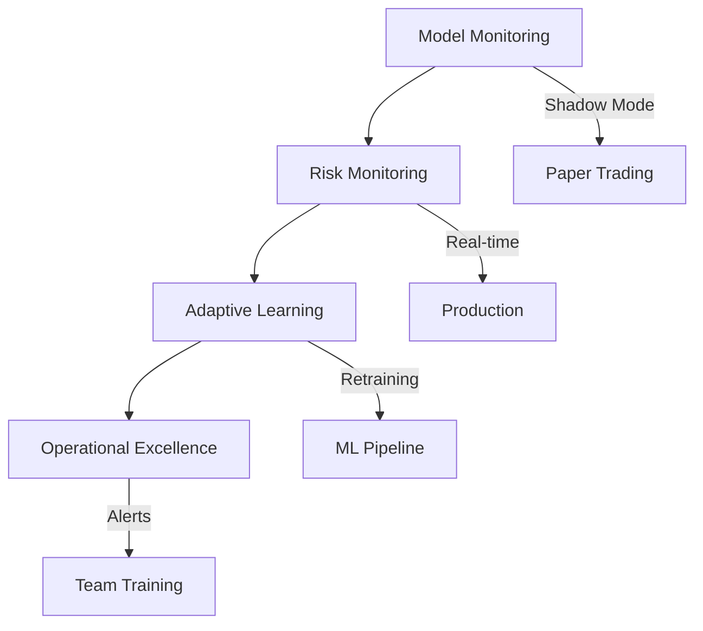

# Phase 3 Task Breakdown - Execution Checklist

**Total Tasks:** 160
**Duration:** 40 working days (8 weeks)
**Team Size:** 2-3 developers recommended

## 📋 Master Task List

### Week 1-2: Model Performance Monitoring (40 tasks)

#### Day 1-2: Enhanced Degradation Detection (8 tasks)
- [ ] `MON-001` Implement Kolmogorov-Smirnov test for feature drift detection
- [ ] `MON-002` Add CUSUM charts for accuracy monitoring
- [ ] `MON-003` Create prediction confidence tracking system
- [ ] `MON-004` Build error pattern analyzer
- [ ] `MON-005` Design degradation alert thresholds
- [ ] `MON-006` Integrate with existing ModelDegradationMonitor
- [ ] `MON-007` Create degradation visualization dashboard
- [ ] `MON-008` Write unit tests for degradation detection

#### Day 3-4: A/B Testing Framework (8 tasks)
- [ ] `MON-009` Design traffic splitting mechanism
- [ ] `MON-010` Implement performance metric collection
- [ ] `MON-011` Add t-test for statistical significance
- [ ] `MON-012` Add chi-square test for categorical outcomes
- [ ] `MON-013` Create automatic model promotion logic
- [ ] `MON-014` Build rollback capability
- [ ] `MON-015` Design A/B test configuration system
- [ ] `MON-016` Write integration tests for A/B framework

#### Day 5-6: Shadow Mode Predictions (8 tasks)
- [ ] `MON-017` Implement virtual portfolio tracker
- [ ] `MON-018` Create parallel prediction pipeline
- [ ] `MON-019` Add performance comparison dashboard
- [ ] `MON-020` Build detailed logging for analysis
- [ ] `MON-021` Integrate with paper trading system
- [ ] `MON-022` Create shadow mode configuration
- [ ] `MON-023` Add virtual trade execution
- [ ] `MON-024` Write tests for shadow mode

#### Day 7-8: Statistical Analysis Suite (8 tasks)
- [ ] `MON-025` Implement paired t-tests for model comparison
- [ ] `MON-026` Add bootstrap confidence intervals
- [ ] `MON-027` Create Cohen's d effect size calculator
- [ ] `MON-028` Build power analysis for sample size
- [ ] `MON-029` Generate automated statistical reports
- [ ] `MON-030` Add Mann-Whitney U test for non-parametric
- [ ] `MON-031` Create p-value adjustment for multiple testing
- [ ] `MON-032` Write comprehensive statistical tests

#### Day 9-10: Integration & Testing (8 tasks)
- [ ] `MON-033` Integrate all monitoring components
- [ ] `MON-034` Create unified monitoring dashboard
- [ ] `MON-035` Write API documentation
- [ ] `MON-036` Perform load testing
- [ ] `MON-037` Create monitoring playbook
- [ ] `MON-038` Set up Grafana dashboards
- [ ] `MON-039` Configure Prometheus metrics
- [ ] `MON-040` Conduct integration testing

### Week 3-4: Risk Monitoring Enhancement (40 tasks)

#### Day 11-12: Real-time Risk Dashboard (8 tasks)
- [ ] `RISK-001` Implement WebSocket server for real-time updates
- [ ] `RISK-002` Create VaR calculation engine
- [ ] `RISK-003` Create CVaR calculation engine
- [ ] `RISK-004` Build exposure aggregation system
- [ ] `RISK-005` Add position Greeks calculator
- [ ] `RISK-006` Design responsive web dashboard
- [ ] `RISK-007` Implement risk limit monitoring
- [ ] `RISK-008` Write tests for risk calculations

#### Day 13-14: Anomaly Detection System (8 tasks)
- [ ] `RISK-009` Train Isolation Forest on historical data
- [ ] `RISK-010` Implement LSTM for time-series anomalies
- [ ] `RISK-011` Add statistical process control charts
- [ ] `RISK-012` Create market microstructure analyzer
- [ ] `RISK-013` Build alert generation system
- [ ] `RISK-014` Design anomaly visualization
- [ ] `RISK-015` Create anomaly investigation tools
- [ ] `RISK-016` Write anomaly detection tests

#### Day 15-16: Stress Testing Automation (8 tasks)
- [ ] `RISK-017` Create historical scenario replayer
- [ ] `RISK-018` Implement Monte Carlo simulator
- [ ] `RISK-019` Add sensitivity analysis framework
- [ ] `RISK-020` Build tail risk calculator
- [ ] `RISK-021` Generate stress test reports
- [ ] `RISK-022` Create custom scenario builder
- [ ] `RISK-023` Add regulatory stress tests
- [ ] `RISK-024` Write stress testing validation

#### Day 17-18: Correlation Monitoring (8 tasks)
- [ ] `RISK-025` Implement rolling correlation calculator
- [ ] `RISK-026` Add correlation breakdown detector
- [ ] `RISK-027` Create diversification metrics
- [ ] `RISK-028` Build concentration risk analyzer
- [ ] `RISK-029` Integrate with position sizing
- [ ] `RISK-030` Add correlation heatmaps
- [ ] `RISK-031` Create correlation alerts
- [ ] `RISK-032` Write correlation tests

#### Day 19-20: Risk Integration (8 tasks)
- [ ] `RISK-033` Integrate risk monitoring components
- [ ] `RISK-034` Create unified risk dashboard
- [ ] `RISK-035` Perform stress test validation
- [ ] `RISK-036` Document risk metrics
- [ ] `RISK-037` Conduct user acceptance testing
- [ ] `RISK-038` Create risk reporting system
- [ ] `RISK-039` Set up risk alerts
- [ ] `RISK-040` Final risk system testing

### Week 5-6: Adaptive Learning (40 tasks)

#### Day 21-22: Online Learning Pipeline (8 tasks)
- [ ] `ADAPT-001` Implement SGD-based online learning
- [ ] `ADAPT-002` Add adaptive learning rate scheduling
- [ ] `ADAPT-003` Create concept drift detector
- [ ] `ADAPT-004` Build memory buffer management
- [ ] `ADAPT-005` Design incremental feature engineering
- [ ] `ADAPT-006` Add online validation system
- [ ] `ADAPT-007` Create learning curve tracking
- [ ] `ADAPT-008` Write online learning tests

#### Day 23-24: Automated Retraining System (8 tasks)
- [ ] `ADAPT-009` Create performance monitoring triggers
- [ ] `ADAPT-010` Implement scheduled retraining
- [ ] `ADAPT-011` Add data volume triggers
- [ ] `ADAPT-012` Build emergency retraining system
- [ ] `ADAPT-013` Design training pipeline automation
- [ ] `ADAPT-014` Create retraining notifications
- [ ] `ADAPT-015` Add retraining history tracking
- [ ] `ADAPT-016` Write retraining system tests

#### Day 25-26: Model Ensemble Management (8 tasks)
- [ ] `ADAPT-017` Implement dynamic weight calculation
- [ ] `ADAPT-018` Add Bayesian model averaging
- [ ] `ADAPT-019` Create model selection logic
- [ ] `ADAPT-020` Build diversity metrics
- [ ] `ADAPT-021` Design ensemble optimization
- [ ] `ADAPT-022` Add ensemble performance tracking
- [ ] `ADAPT-023` Create ensemble visualization
- [ ] `ADAPT-024` Write ensemble tests

#### Day 27-28: Feature Evolution Tracking (8 tasks)
- [ ] `ADAPT-025` Track feature importance history
- [ ] `ADAPT-026` Calculate stability metrics
- [ ] `ADAPT-027` Detect emerging features
- [ ] `ADAPT-028` Identify obsolete features
- [ ] `ADAPT-029` Generate evolution reports
- [ ] `ADAPT-030` Create feature lifecycle management
- [ ] `ADAPT-031` Add feature deprecation system
- [ ] `ADAPT-032` Write feature evolution tests

#### Day 29-30: Adaptive Integration (8 tasks)
- [ ] `ADAPT-033` Integrate adaptive learning components
- [ ] `ADAPT-034` Create learning dashboard
- [ ] `ADAPT-035` Test retraining automation
- [ ] `ADAPT-036` Document adaptation logic
- [ ] `ADAPT-037` Validate with backtesting
- [ ] `ADAPT-038` Create adaptive configuration
- [ ] `ADAPT-039` Set up learning metrics
- [ ] `ADAPT-040` Final adaptive system testing

### Week 7-8: Operational Excellence (40 tasks)

#### Day 31-32: Enhanced Structured Logging (8 tasks)
- [ ] `OPS-001` Implement JSON structured logging
- [ ] `OPS-002` Add correlation ID tracking
- [ ] `OPS-003` Create performance metric logging
- [ ] `OPS-004` Build decision trace system
- [ ] `OPS-005` Design log aggregation pipeline
- [ ] `OPS-006` Add log retention policies
- [ ] `OPS-007` Create log analysis tools
- [ ] `OPS-008` Write logging tests

#### Day 33-34: Intelligent Alert System (8 tasks)
- [ ] `OPS-009` Create alert prioritization logic
- [ ] `OPS-010` Implement deduplication system
- [ ] `OPS-011` Add alert correlation engine
- [ ] `OPS-012` Build auto-resolution for known issues
- [ ] `OPS-013` Design escalation procedures
- [ ] `OPS-014` Create alert routing rules
- [ ] `OPS-015` Add alert acknowledgment system
- [ ] `OPS-016` Write alert system tests

#### Day 35-36: Alert Fatigue Prevention (8 tasks)
- [ ] `OPS-017` Implement dynamic threshold adjustment
- [ ] `OPS-018` Create alert bundling logic
- [ ] `OPS-019` Build intelligent routing system
- [ ] `OPS-020` Add feedback learning mechanism
- [ ] `OPS-021` Design alert effectiveness metrics
- [ ] `OPS-022` Create alert suppression rules
- [ ] `OPS-023` Add alert quality scoring
- [ ] `OPS-024` Write alert optimization tests

#### Day 37-38: Operational Dashboards (8 tasks)
- [ ] `OPS-025` Create system health monitors
- [ ] `OPS-026` Build performance metric aggregators
- [ ] `OPS-027` Design alert summary views
- [ ] `OPS-028` Add capacity planning tools
- [ ] `OPS-029` Implement trend analysis
- [ ] `OPS-030` Create SLA tracking
- [ ] `OPS-031` Add cost monitoring
- [ ] `OPS-032` Write dashboard tests

#### Day 39-40: Documentation & Training (8 tasks)
- [ ] `OPS-033` Create operational runbooks
- [ ] `OPS-034` Document alert responses
- [ ] `OPS-035` Build training materials
- [ ] `OPS-036` Conduct team training sessions
- [ ] `OPS-037` Establish on-call procedures
- [ ] `OPS-038` Create troubleshooting guides
- [ ] `OPS-039` Document best practices
- [ ] `OPS-040` Final operational review

## 📊 Task Dependencies

## 🎯 Priority Matrix

### Critical Path (Must Complete)
1. `MON-001` to `MON-008` - Degradation Detection
2. `RISK-001` to `RISK-008` - Risk Dashboard
3. `ADAPT-009` to `ADAPT-016` - Auto Retraining
4. `OPS-009` to `OPS-016` - Alert System

### High Priority
1. `MON-009` to `MON-016` - A/B Testing
2. `RISK-009` to `RISK-016` - Anomaly Detection
3. `ADAPT-001` to `ADAPT-008` - Online Learning
4. `OPS-001` to `OPS-008` - Structured Logging

### Medium Priority
1. `MON-017` to `MON-024` - Shadow Mode
2. `RISK-017` to `RISK-024` - Stress Testing
3. `ADAPT-017` to `ADAPT-024` - Ensemble Management
4. `OPS-017` to `OPS-024` - Alert Optimization

### Nice to Have
1. `MON-025` to `MON-032` - Statistical Suite
2. `RISK-025` to `RISK-032` - Correlation Monitoring
3. `ADAPT-025` to `ADAPT-032` - Feature Evolution
4. `OPS-025` to `OPS-032` - Dashboards

## 👥 Team Allocation Suggestion

### Developer 1: ML & Monitoring Focus
- Week 1-2: Lead on Model Monitoring
- Week 3-4: Support Risk Monitoring
- Week 5-6: Lead on Adaptive Learning
- Week 7-8: Support Operations

### Developer 2: Risk & Operations Focus
- Week 1-2: Support Model Monitoring
- Week 3-4: Lead on Risk Monitoring
- Week 5-6: Support Adaptive Learning
- Week 7-8: Lead on Operations

### Developer 3 (if available): Testing & Integration
- Week 1-2: Testing & Integration
- Week 3-4: Dashboard Development
- Week 5-6: Performance Testing
- Week 7-8: Documentation & Training

## 📈 Progress Tracking

### Week 1-2 Milestones
- [ ] Day 2: Degradation detection complete
- [ ] Day 4: A/B testing framework ready
- [ ] Day 6: Shadow mode operational
- [ ] Day 8: Statistical suite ready
- [ ] Day 10: Integration complete

### Week 3-4 Milestones
- [ ] Day 12: Risk dashboard live
- [ ] Day 14: Anomaly detection active
- [ ] Day 16: Stress testing automated
- [ ] Day 18: Correlation monitoring ready
- [ ] Day 20: Risk system integrated

### Week 5-6 Milestones
- [ ] Day 22: Online learning active
- [ ] Day 24: Auto retraining ready
- [ ] Day 26: Ensemble management live
- [ ] Day 28: Feature evolution tracking
- [ ] Day 30: Adaptive system complete

### Week 7-8 Milestones
- [ ] Day 32: Structured logging deployed
- [ ] Day 34: Alert system active
- [ ] Day 36: Alert fatigue reduced
- [ ] Day 38: Dashboards operational
- [ ] Day 40: Team fully trained

## 🔄 Daily Standup Questions

1. What tasks did you complete yesterday?
2. What tasks are you working on today?
3. Are there any blockers?
4. Do you need any help or clarification?
5. Are we on track for the weekly milestone?

## 📊 Metrics to Track

### Development Metrics
- Tasks completed per day
- Code review turnaround time
- Test coverage percentage
- Bug discovery rate
- Documentation completeness

### System Metrics
- Model performance stability
- Risk calculation accuracy
- Alert effectiveness
- System response time
- Resource utilization

## 🚀 Definition of Done

Each task is considered complete when:
1. ✅ Code is written and reviewed
2. ✅ Unit tests pass with >90% coverage
3. ✅ Integration tests pass
4. ✅ Documentation is updated
5. ✅ Code is merged to main branch
6. ✅ Deployment scripts updated
7. ✅ Monitoring configured
8. ✅ Team is notified

## 📝 Risk Register

| Risk | Impact | Probability | Mitigation |
|------|--------|-------------|------------|
| Scope creep | High | Medium | Strict change control |
| Technical debt | Medium | High | Regular refactoring |
| Team availability | High | Low | Cross-training |
| Integration issues | High | Medium | Early integration |
| Performance problems | Medium | Medium | Regular profiling |

## 🎉 Completion Criteria

Phase 3 is complete when:
- [ ] All 160 tasks completed
- [ ] 90% test coverage achieved
- [ ] Documentation complete
- [ ] Team training finished
- [ ] System deployed to production
- [ ] Monitoring active and stable
- [ ] Success metrics achieved

---

**Document Status:** READY FOR EXECUTION
**Task Count:** 160 tasks
**Estimated Effort:** 320-480 person-hours
**Recommended Team:** 2-3 developers

*Use this checklist to track daily progress and ensure comprehensive Phase 3 implementation.*
