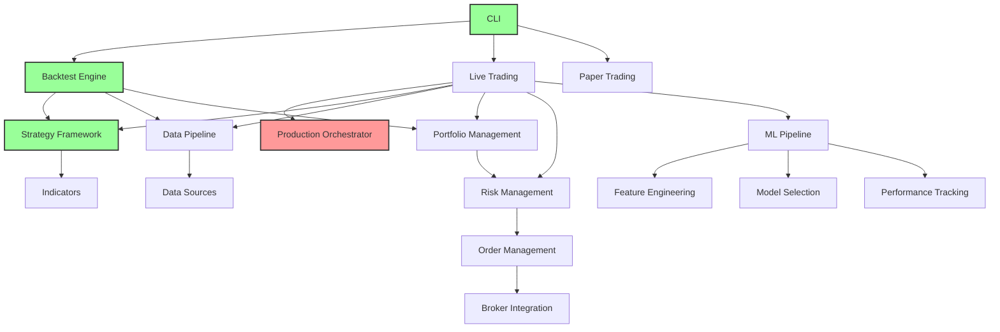

# GPT-Trader Dependency Map

**Generated:** 2025-01-14
**Analysis of Internal and External Dependencies**

## Internal Module Dependencies

### Core Dependency Flow

**Legend:**
- 🟢 Green: Working components
- 🔴 Red: Missing/broken components

## Detailed Dependency Analysis

### 1. CLI System Dependencies

#### Working Dependencies ✅
- `src/bot/cli/cli.py` → `src/bot/cli/commands.py` ✅
- `src/bot/cli/commands.py` → `src/bot/cli/cli_utils.py` ✅
- CLI argument parsing → command routing ✅

#### Broken Dependencies ❌
- `src/bot/cli/commands.py` → `src/bot/backtest/__init__.py` ❌
  - **Issue:** Imports `run_backtest` but parameter mismatch
  - **Error:** `run_backtest() got an unexpected keyword argument 'start_date'`
  - **Fix Required:** Parameter alignment

### 2. Backtest Engine Dependencies

#### Working Dependencies ✅
- `src/bot/backtest/engine_portfolio.py` → `src/bot/strategy/base.py` ✅
- `src/bot/backtest/engine_portfolio.py` → `src/bot/dataflow/sources/yfinance_source.py` ✅
- `src/bot/backtest/engine_portfolio.py` → `src/bot/portfolio/allocator.py` ✅

#### Problematic Dependencies ⚠️
- Backtest → Strategy validation (basic only)
- Backtest → Risk management (minimal integration)

### 3. Strategy Framework Dependencies

#### Working Dependencies ✅
- `src/bot/strategy/demo_ma.py` → `src/bot/strategy/base.py` ✅
- `src/bot/strategy/trend_breakout.py` → `src/bot/strategy/base.py` ✅
- `src/bot/strategy/*` → `src/bot/indicators/*` ✅

#### Missing Dependencies ❌
- Strategy → ML predictions (no integration)
- Strategy → risk constraints (no enforcement)

### 4. Production Orchestrator Dependencies

#### COMPLETELY MISSING ❌
- **File:** `src/bot/live/production_orchestrator.py` (deleted)
- **Impact:** Blocks all live trading functionality
- **Dependencies Affected:**
  - Live trading ❌
  - Paper trading ❌
  - Real-time monitoring ❌
  - ML integration ❌

### 5. ML Pipeline Dependencies

#### Internal Dependencies ⚠️
- `src/bot/ml/integrated_pipeline.py` → Feature engineering ✅
- `src/bot/ml/integrated_pipeline.py` → Model validation ✅
- ML components → Strategy selection ❌ (no integration)

#### External Dependencies ❌
- `src/bot/ml/auto_retraining.py` → `schedule` module ❌
  - **Error:** `ModuleNotFoundError: No module named 'schedule'`
  - **Fix:** Add to pyproject.toml

### 6. Data Pipeline Dependencies

#### Working Dependencies ✅
- `src/bot/dataflow/sources/yfinance_source.py` → `yfinance` ✅
- Data validation → pandas operations ✅
- Historical data caching → file system ✅

#### Missing Dependencies ❌
- Real-time data feeds → websocket connections ❌
- Alternative data sources → external APIs ❌

## External Dependencies Analysis

### Working External Dependencies ✅

| Package | Version | Usage | Status |
|---------|---------|-------|--------|
| pandas | ^2.2.2 | Data manipulation | ✅ Working |
| numpy | ^1.26.4 | Numerical computing | ✅ Working |
| yfinance | ^0.2.40 | Market data | ✅ Working |
| matplotlib | ^3.9.0 | Plotting | ✅ Working |
| pydantic | ^2.7.4 | Data validation | ✅ Working |
| typer | ^0.16.0 | CLI framework | ✅ Working |
| streamlit | ^1.48.0 | Dashboard | ✅ Basic |

### Missing External Dependencies ❌

| Package | Required By | Impact | Priority |
|---------|-------------|--------|----------|
| schedule | auto_retraining.py | ML pipeline broken | Critical |
| psycopg2 | Database integration | No persistence | High |
| redis | Caching/sessions | Performance impact | Medium |
| websocket-client | Real-time data | No live data | High |

### Optional Dependencies (Not Installed) ⚠️

| Package | Feature | Impact |
|---------|---------|--------|
| torch | Deep learning | Limited ML capabilities |
| tensorflow | Alternative DL | Limited ML capabilities |
| tensorboard | ML monitoring | No ML observability |

## Dependency Issues by Category

### Import Errors (Test Blocking)
1. **Missing 'schedule' module** - Breaks ML pipeline import
2. **Circular import potential** - Some modules may have circular dependencies
3. **Path resolution issues** - Test collection fails due to import paths

### Integration Gaps
1. **ML → Strategy** - No data flow from predictions to decisions
2. **Portfolio → Risk** - Basic connection only
3. **Risk → Execution** - No real-time risk controls
4. **Monitoring → All Systems** - No centralized observability

### Configuration Dependencies
1. **Multiple config systems** - bot/config/ has 4+ config approaches
2. **Environment variables** - Unclear which are required
3. **Secrets management** - No unified approach to API keys

## Critical Path Dependencies

### To Fix Basic Functionality:
1. Fix CLI → Backtest parameter mismatch
2. Add 'schedule' to dependencies
3. Resolve test import errors

### To Enable Live Trading:
1. Recreate production orchestrator
2. Implement event bus for component communication
3. Add database persistence layer
4. Connect real-time data feeds

### To Complete ML Integration:
1. Connect ML predictions to strategy selection
2. Implement online learning feedback loop
3. Add model performance monitoring
4. Create automated retraining triggers

## Dependency Risk Assessment

### High Risk Dependencies:
- **Production orchestrator missing** - Blocks 60% of functionality
- **Test suite broken** - No quality assurance possible
- **ML pipeline disconnected** - Core value proposition lost

### Medium Risk Dependencies:
- **Database integration missing** - No state persistence
- **Real-time data missing** - Limited to historical backtesting
- **Security layer incomplete** - Cannot deploy safely

### Low Risk Dependencies:
- **Optional ML packages** - Can work with basic ML
- **Advanced order types** - Basic trading still possible
- **Alternative data sources** - Core data sources work

## Recommended Dependency Fixes

### Immediate (Week 1):
1. Add `schedule` package to pyproject.toml
2. Fix CLI-backtest parameter alignment
3. Resolve critical test import errors

### Short-term (Weeks 2-4):
1. Recreate production orchestrator skeleton
2. Implement basic event bus
3. Add database connection layer
4. Connect ML to strategy selection

### Medium-term (Weeks 5-8):
1. Add real-time data feeds
2. Implement comprehensive monitoring
3. Complete risk management integration
4. Add advanced order management

## Dependency Management Strategy

### Version Control:
- Pin major versions for stability
- Regular dependency updates in controlled manner
- Security vulnerability monitoring

### Optional Dependencies:
- Use extras for optional features (deep-learning, etc.)
- Graceful degradation when optional deps missing
- Clear documentation of feature requirements

### Development Dependencies:
- Separate dev/test dependencies from production
- Use consistent linting/formatting tools
- Automated dependency scanning

## Conclusion

The dependency map reveals a system with solid individual components but critical integration gaps. The missing production orchestrator creates a cascade of dependency failures that blocks most advanced functionality. However, the core dependencies (data, strategies, backtesting) are solid, providing a good foundation for rebuilding the integration layer.

**Key Insight:** This is an integration problem, not a feature development problem.
EOF < /dev/null
