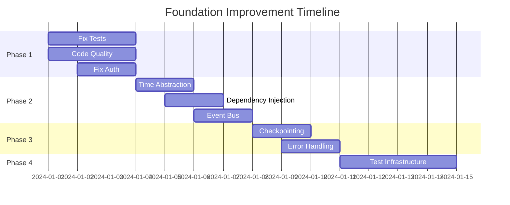

# Foundation Improvement Plan - GPT-Trader V2

## Executive Summary

Based on comprehensive analysis of the GPT-Trader V2 codebase, this plan addresses critical foundation issues that are blocking stable production deployment. The system shows promise with its vertical slice architecture but requires focused improvements in core areas.

## Current State Assessment

### 🟢 Strengths
- **Vertical Slice Architecture**: 15 isolated feature modules (~500 tokens each)
- **Type Safety**: Core interfaces defined in `brokerages.core.interfaces`
- **Persistence Layer**: Event/order stores with atomic operations
- **Risk Management**: Multiple safety systems (circuit breakers, position limits)
- **Environment Flexibility**: Support for dev/canary/prod profiles

### 🔴 Critical Issues

#### 1. Test Suite Health (SEVERITY: HIGH)
- **Unit Tests**: 10 failures in core components (backtest, paper trade)
- **Integration Tests**: 8 errors in ML confidence scoring
- **Test Coverage**: ~60% (target: 80%)
- **Flaky Tests**: Time-dependent tests causing CI failures

#### 2. Code Quality (SEVERITY: MEDIUM)
- **Formatting**: 178 files need reformatting (Black)
- **Linting**: 9,438 issues (6,167 whitespace, 1,112 type annotations)
- **Type Checking**: 20+ mypy errors in core modules
- **Tech Debt**: 4 TODO/FIXME markers, 31 files with time dependencies

#### 3. Configuration & Secrets (SEVERITY: HIGH)
- **Auth Failures**: CDP private key deserialization issues
- **Environment Sprawl**: Complex fallback chain for API keys
- **Missing Validation**: No upfront config validation
- **Network Issues**: WebSocket connectivity failures in production

#### 4. Architectural Debt (SEVERITY: MEDIUM)
- **Time Coupling**: 31 files directly use time/sleep (no clock abstraction)
- **Mixed Async Models**: Inconsistent use of asyncio vs threads
- **State Management**: No consistent checkpointing/recovery
- **Error Taxonomy**: Inconsistent error handling patterns

## Core Foundation Definition

**Our "fixed foundation" means:**
1. **Reliability**: 95%+ test pass rate, <2% flaky tests
2. **Architecture**: Clean boundaries, dependency injection, event-driven
3. **Testability**: 80%+ coverage, deterministic tests, fast feedback
4. **Performance**: <100ms latency, <50MB memory, no resource leaks
5. **Developer UX**: 5-minute setup, clear errors, consistent patterns

## Success Criteria

✅ **Near-term (1 week)**:
- Green CI on all branches
- Zero critical mypy errors
- Successful production preflight check
- All unit tests passing

✅ **Mid-term (2 weeks)**:
- 80% test coverage
- Zero linting errors
- Time abstraction implemented
- Configuration validation complete

✅ **Long-term (1 month)**:
- Full event-driven architecture
- State recovery system
- Performance benchmarks met
- Developer documentation complete

## Implementation Plan

### Phase 1: Stop the Bleeding (Days 1-3)

**1.1 Fix Test Suite**
```bash
# Fix failing unit tests
poetry run pytest tests/unit/bot_v2/features/test_backtest_unit.py --tb=short
# Fix paper trade tests  
poetry run pytest tests/unit/bot_v2/features/paper_trade/ -v
# Fix ML confidence errors
poetry run pytest tests/integration/bot_v2/test_sprint1_ml_enhancements.py -v
```

**1.2 Code Quality Baseline**
```bash
# Auto-format all code
poetry run black src/bot_v2 tests/
# Fix critical linting
poetry run ruff check src/bot_v2 --fix
# Address type errors
poetry run mypy src/bot_v2 --strict
```

**1.3 Fix Authentication**
```python
# src/bot_v2/features/brokerages/coinbase/cdp_auth_v3.py
class CDPAuthV3:
    def __init__(self, api_key: str, private_key: str):
        # Fix: Handle multi-line private keys properly
        private_key = self._normalize_private_key(private_key)
        self.private_key = self._load_private_key(private_key)
    
    def _normalize_private_key(self, key: str) -> str:
        # Strip and reconstruct with proper line breaks
        lines = key.strip().split('\\n')
        return '\n'.join(lines)
```

### Phase 2: Clean Architecture (Days 4-7)

**2.1 Time Abstraction**
```python
# src/bot_v2/core/clock.py
from abc import ABC, abstractmethod
from datetime import datetime
from typing import Optional

class Clock(ABC):
    @abstractmethod
    def now(self) -> datetime:
        pass
    
    @abstractmethod
    def sleep(self, seconds: float) -> None:
        pass

class RealClock(Clock):
    def now(self) -> datetime:
        return datetime.now(timezone.utc)
    
    def sleep(self, seconds: float) -> None:
        time.sleep(seconds)

class TestClock(Clock):
    def __init__(self, start_time: datetime):
        self.current_time = start_time
    
    def now(self) -> datetime:
        return self.current_time
    
    def sleep(self, seconds: float) -> None:
        self.current_time += timedelta(seconds=seconds)
```

**2.2 Dependency Injection**
```python
# src/bot_v2/core/container.py
from dataclasses import dataclass
from typing import Protocol

@dataclass
class Container:
    clock: Clock
    broker: IBrokerage
    event_store: EventStore
    risk_manager: RiskManager
    
    @classmethod
    def create_production(cls) -> 'Container':
        return cls(
            clock=RealClock(),
            broker=create_brokerage(),
            event_store=EventStore(),
            risk_manager=LiveRiskManager()
        )
    
    @classmethod
    def create_test(cls) -> 'Container':
        return cls(
            clock=TestClock(datetime(2024, 1, 1)),
            broker=MockBroker(),
            event_store=InMemoryEventStore(),
            risk_manager=MockRiskManager()
        )
```

**2.3 Event Bus**
```python
# src/bot_v2/core/events.py
from enum import Enum
from typing import Any, Callable, Dict, List

class EventType(Enum):
    ORDER_PLACED = "order_placed"
    ORDER_FILLED = "order_filled"
    POSITION_OPENED = "position_opened"
    RISK_LIMIT_HIT = "risk_limit_hit"

class EventBus:
    def __init__(self):
        self._handlers: Dict[EventType, List[Callable]] = {}
    
    def subscribe(self, event_type: EventType, handler: Callable) -> None:
        self._handlers.setdefault(event_type, []).append(handler)
    
    def publish(self, event_type: EventType, data: Any) -> None:
        for handler in self._handlers.get(event_type, []):
            handler(data)
```

### Phase 3: State & Recovery (Days 8-10)

**3.1 State Checkpointing**
```python
# src/bot_v2/core/checkpoint.py
@dataclass
class Checkpoint:
    timestamp: datetime
    positions: Dict[str, Position]
    pending_orders: List[Order]
    risk_metrics: RiskMetrics
    
    def save(self, path: Path) -> None:
        with path.open('w') as f:
            json.dump(self.to_dict(), f)
    
    @classmethod
    def load(cls, path: Path) -> 'Checkpoint':
        with path.open() as f:
            return cls.from_dict(json.load(f))
```

**3.2 Error Classification**
```python
# src/bot_v2/core/errors.py
class BotError(Exception):
    retryable: bool = False
    severity: str = "error"

class NetworkError(BotError):
    retryable = True
    severity = "warning"

class AuthenticationError(BotError):
    retryable = False
    severity = "critical"

class RiskLimitError(BotError):
    retryable = False
    severity = "critical"
```

### Phase 4: Testing Infrastructure (Days 11-14)

**4.1 Deterministic Tests**
```python
# tests/bot_v2/conftest.py
@pytest.fixture
def test_container():
    return Container.create_test()

@pytest.fixture
def fixed_time():
    return datetime(2024, 1, 1, 12, 0, 0, tzinfo=timezone.utc)

@pytest.fixture(autouse=True)
def deterministic_random():
    random.seed(42)
    np.random.seed(42)
    yield
    # Reset after test
```

**4.2 Integration Test Harness**
```python
# tests/bot_v2/harness.py
class TestHarness:
    def __init__(self):
        self.container = Container.create_test()
        self.events: List[Event] = []
        
    def run_strategy(self, strategy: Strategy, market_data: List[Candle]) -> List[Trade]:
        # Deterministic strategy execution
        pass
```

## Resource Requirements

### Team Allocation
- **Lead Engineer**: Full-time for 2 weeks
- **Test Engineer**: 50% for test suite fixes
- **DevOps**: 25% for CI/CD improvements

### Infrastructure
- **CI Resources**: Parallel test execution (4 workers)
- **Monitoring**: Structured logging to DataDog/CloudWatch
- **Staging**: Dedicated sandbox environment

## Risk Mitigation

| Risk | Likelihood | Impact | Mitigation |
|------|------------|--------|------------|
| Breaking changes | Medium | High | Feature flags, gradual rollout |
| Performance regression | Low | Medium | Benchmark suite, profiling |
| Test suite complexity | High | Medium | Incremental fixes, test pyramid |
| API compatibility | Low | High | Extensive integration tests |

## Monitoring & Metrics

### Key Metrics
- **Test Pass Rate**: Target 95%+
- **Build Time**: Target <5 minutes
- **Code Coverage**: Target 80%+
- **Type Coverage**: Target 90%+
- **Mean Time to Recovery**: Target <1 hour

### Dashboards
```yaml
# monitoring/dashboards/foundation.yaml
panels:
  - title: "CI Health"
    metrics: ["test_pass_rate", "build_duration", "flaky_tests"]
  - title: "Code Quality"
    metrics: ["coverage", "linting_errors", "type_errors"]
  - title: "Runtime Health"
    metrics: ["error_rate", "latency_p99", "memory_usage"]
```

## Timeline



## Rollout Strategy

1. **Week 1**: Emergency fixes (tests, auth, formatting)
2. **Week 2**: Architecture improvements (DI, events, time)
3. **Week 3**: Testing and validation
4. **Week 4**: Production deployment with monitoring

## Validation Checklist

Before declaring foundation "fixed":

- [ ] All tests passing (0 failures)
- [ ] Code formatted (Black)
- [ ] No critical linting errors
- [ ] Type checking passes (mypy strict)
- [ ] Authentication working (preflight passes)
- [ ] Time abstraction implemented
- [ ] Event bus integrated
- [ ] State recovery tested
- [ ] Performance benchmarks met
- [ ] Documentation updated

## Next Steps

1. **Immediate**: Fix failing tests and authentication
2. **This Week**: Implement time abstraction and DI
3. **Next Week**: Complete event-driven refactor
4. **Month End**: Full production deployment

## Appendix: Quick Fixes

### Fix CDP Authentication
```bash
# Validate and fix private key format
echo "$COINBASE_PROD_CDP_PRIVATE_KEY" | openssl ec -check
```

### Run Full Test Suite
```bash
# With proper markers
poetry run pytest -m "not slow and not performance" -v
```

### Format All Code
```bash
poetry run black src/ tests/ scripts/
poetry run ruff check src/ --fix
```

### Type Check with Baseline
```bash
poetry run mypy src/bot_v2 --ignore-missing-imports
```

---

*This plan provides a pragmatic path to production readiness while maintaining system stability. Focus on incremental improvements with clear validation at each step.*