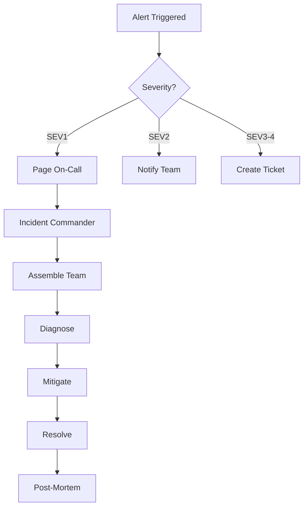

# GPT-Trader Monitoring & Incident Response Playbook

## Table of Contents
1. [Monitoring Overview](#monitoring-overview)
2. [Key Metrics & Thresholds](#key-metrics--thresholds)
3. [Alert Definitions](#alert-definitions)
4. [Incident Response Procedures](#incident-response-procedures)
5. [Performance Monitoring](#performance-monitoring)
6. [Risk Monitoring](#risk-monitoring)
7. [System Health Monitoring](#system-health-monitoring)
8. [Runbooks](#runbooks)

## Monitoring Overview

### Monitoring Stack
- **Metrics**: Prometheus + Grafana
- **Logs**: ELK Stack (Elasticsearch, Logstash, Kibana)
- **Alerts**: PagerDuty / Slack
- **APM**: DataDog / New Relic (optional)
- **Custom**: Internal monitoring dashboard

### Monitoring Levels

| Level | Response Time | Team | Examples |
|-------|--------------|------|----------|
| Critical | < 5 min | On-call + Management | System down, >15% drawdown |
| High | < 30 min | On-call | Model degradation, API failures |
| Medium | < 2 hours | Dev team | Performance issues, warnings |
| Low | < 24 hours | Dev team | Optimization opportunities |

## Key Metrics & Thresholds

### Trading Performance Metrics

```yaml
metrics:
  model_accuracy:
    description: "Current model prediction accuracy"
    threshold_warning: 0.55
    threshold_critical: 0.52
    check_interval: 5m
    
  sharpe_ratio:
    description: "Risk-adjusted return metric"
    threshold_warning: 0.8
    threshold_critical: 0.5
    check_interval: 15m
    
  portfolio_drawdown:
    description: "Current drawdown from peak"
    threshold_warning: 0.10
    threshold_critical: 0.15
    check_interval: 1m
    
  daily_return:
    description: "Daily portfolio return"
    threshold_warning: -0.03
    threshold_critical: -0.05
    check_interval: 5m
    
  win_rate:
    description: "Percentage of profitable trades"
    threshold_warning: 0.48
    threshold_critical: 0.45
    check_interval: 30m
```

### System Performance Metrics

```yaml
metrics:
  api_latency:
    description: "Trading API response time"
    threshold_warning: 500ms
    threshold_critical: 1000ms
    check_interval: 30s
    
  prediction_latency:
    description: "Model inference time"
    threshold_warning: 100ms
    threshold_critical: 500ms
    check_interval: 1m
    
  database_connections:
    description: "Active database connections"
    threshold_warning: 80
    threshold_critical: 95
    check_interval: 30s
    
  memory_usage:
    description: "System memory utilization"
    threshold_warning: 80%
    threshold_critical: 90%
    check_interval: 30s
    
  cpu_usage:
    description: "CPU utilization"
    threshold_warning: 70%
    threshold_critical: 85%
    check_interval: 30s
```

## Alert Definitions

### Critical Alerts

#### CRIT-001: System Down
```yaml
alert: SystemDown
condition: up{job="gpt-trader"} == 0
duration: 1m
action:
  - Page on-call engineer
  - Send SMS to team lead
  - Create incident ticket
  - Execute failover procedure
```

#### CRIT-002: Excessive Drawdown
```yaml
alert: ExcessiveDrawdown
condition: portfolio_drawdown > 0.15
duration: instant
action:
  - Stop all trading immediately
  - Close all positions
  - Page risk manager
  - Notify compliance
```

#### CRIT-003: Model Failure
```yaml
alert: ModelFailure
condition: model_error_rate > 0.10
duration: 5m
action:
  - Switch to fallback model
  - Page ML engineer
  - Pause new predictions
  - Log detailed diagnostics
```

### High Priority Alerts

#### HIGH-001: Model Degradation
```yaml
alert: ModelDegradation
condition: model_accuracy < 0.55 OR sharpe_ratio < 0.8
duration: 15m
action:
  - Notify ML team
  - Trigger model evaluation
  - Consider retraining
  - Reduce position sizes
```

#### HIGH-002: API Connectivity Issues
```yaml
alert: APIConnectivityIssues
condition: api_error_rate > 0.05
duration: 5m
action:
  - Switch to backup API
  - Notify operations team
  - Log all failed requests
  - Check rate limits
```

## Incident Response Procedures

### Incident Classification

```python
class IncidentSeverity(Enum):
    SEV1 = "Complete system failure or data loss"
    SEV2 = "Major functionality broken, significant financial impact"
    SEV3 = "Minor functionality broken, limited impact"
    SEV4 = "Cosmetic issues, no immediate impact"
```

### Response Flow



### Incident Commander Checklist

1. **Assess Severity**
   - [ ] Determine impact on trading
   - [ ] Check financial exposure
   - [ ] Evaluate data integrity

2. **Immediate Actions**
   - [ ] Stop trading if necessary
   - [ ] Switch to safe mode
   - [ ] Notify stakeholders

3. **Investigation**
   - [ ] Gather logs
   - [ ] Check recent changes
   - [ ] Review monitoring data

4. **Mitigation**
   - [ ] Apply temporary fix
   - [ ] Reduce risk exposure
   - [ ] Monitor closely

5. **Resolution**
   - [ ] Deploy permanent fix
   - [ ] Verify normal operation
   - [ ] Update documentation

## Performance Monitoring

### Daily Performance Review

```python
# daily_performance_check.py
def daily_performance_review():
    metrics = {
        'total_trades': get_daily_trade_count(),
        'win_rate': calculate_win_rate(),
        'pnl': calculate_daily_pnl(),
        'sharpe': calculate_sharpe_ratio(),
        'max_drawdown': get_max_drawdown(),
        'model_accuracy': get_model_accuracy()
    }
    
    # Check against thresholds
    issues = []
    if metrics['win_rate'] < 0.48:
        issues.append(f"Low win rate: {metrics['win_rate']:.2%}")
    if metrics['sharpe'] < 0.8:
        issues.append(f"Low Sharpe ratio: {metrics['sharpe']:.2f}")
    if metrics['model_accuracy'] < 0.55:
        issues.append(f"Low model accuracy: {metrics['model_accuracy']:.2%}")
    
    # Generate report
    report = generate_performance_report(metrics, issues)
    send_report(report)
    
    return len(issues) == 0
```

### Model Performance Tracking

```sql
-- Query for model performance metrics
SELECT 
    DATE(prediction_time) as date,
    model_id,
    COUNT(*) as predictions,
    AVG(CASE WHEN actual = predicted THEN 1 ELSE 0 END) as accuracy,
    AVG(confidence) as avg_confidence,
    STDDEV(confidence) as confidence_std
FROM performance.predictions
WHERE prediction_time > NOW() - INTERVAL '7 days'
GROUP BY DATE(prediction_time), model_id
ORDER BY date DESC;
```

## Risk Monitoring

### Position Risk Dashboard

```python
def monitor_position_risk():
    positions = get_open_positions()
    
    risk_metrics = {
        'total_exposure': sum(p.value for p in positions),
        'largest_position': max(p.value for p in positions),
        'concentration_risk': calculate_concentration(),
        'var_95': calculate_var(0.95),
        'expected_shortfall': calculate_cvar(0.95)
    }
    
    # Check risk limits
    violations = []
    if risk_metrics['total_exposure'] > MAX_EXPOSURE:
        violations.append("Total exposure limit exceeded")
    if risk_metrics['largest_position'] > MAX_POSITION_SIZE:
        violations.append("Position size limit exceeded")
    if risk_metrics['var_95'] > MAX_VAR:
        violations.append("VaR limit exceeded")
    
    if violations:
        trigger_risk_alert(violations)
        reduce_positions()
    
    return risk_metrics
```

### Circuit Breakers

```python
class CircuitBreaker:
    def __init__(self):
        self.daily_loss_limit = 0.05
        self.consecutive_losses = 5
        self.drawdown_limit = 0.20
    
    def check_triggers(self):
        if self.get_daily_loss() > self.daily_loss_limit:
            self.trigger_daily_loss_breaker()
        
        if self.get_consecutive_losses() >= self.consecutive_losses:
            self.trigger_loss_streak_breaker()
        
        if self.get_current_drawdown() > self.drawdown_limit:
            self.trigger_drawdown_breaker()
    
    def trigger_daily_loss_breaker(self):
        logger.critical("Daily loss limit breached - stopping trading")
        stop_all_trading()
        close_all_positions()
        send_alert("CIRCUIT BREAKER: Daily loss limit")
```

## System Health Monitoring

### Infrastructure Health Checks

```bash
#!/bin/bash
# system_health_check.sh

# Check disk space
DISK_USAGE=$(df -h / | awk 'NR==2 {print $5}' | sed 's/%//')
if [ $DISK_USAGE -gt 80 ]; then
    send_alert "High disk usage: ${DISK_USAGE}%"
fi

# Check memory
MEM_USAGE=$(free | grep Mem | awk '{print int($3/$2 * 100)}')
if [ $MEM_USAGE -gt 85 ]; then
    send_alert "High memory usage: ${MEM_USAGE}%"
fi

# Check database connections
DB_CONNS=$(psql -U gpttrader -t -c "SELECT count(*) FROM pg_stat_activity")
if [ $DB_CONNS -gt 90 ]; then
    send_alert "High database connections: ${DB_CONNS}"
fi

# Check service status
for service in gpt-trader postgresql redis nginx; do
    if ! systemctl is-active --quiet $service; then
        send_alert "Service $service is not running"
    fi
done
```

### Application Health Endpoints

```python
@app.route('/health/detailed')
def detailed_health():
    health_status = {
        'timestamp': datetime.now().isoformat(),
        'components': {
            'database': check_database_health(),
            'redis': check_redis_health(),
            'model': check_model_health(),
            'api': check_api_health()
        },
        'metrics': {
            'uptime': get_uptime(),
            'requests_per_second': get_rps(),
            'error_rate': get_error_rate(),
            'active_connections': get_connection_count()
        }
    }
    
    overall_health = all(
        component['healthy'] 
        for component in health_status['components'].values()
    )
    
    return jsonify(health_status), 200 if overall_health else 503
```

## Runbooks

### Runbook: High Memory Usage

```markdown
## Problem: Memory usage exceeds 85%

### Symptoms
- Slow response times
- OOM errors in logs
- System instability

### Diagnosis
1. Check top memory consumers: `htop`
2. Review recent model loads: `ls -la /opt/gpt-trader/models/`
3. Check for memory leaks: `ps aux --sort=-%mem | head`

### Resolution
1. Restart application: `sudo systemctl restart gpt-trader`
2. Clear Redis cache: `redis-cli FLUSHDB`
3. Reduce model complexity if persistent
4. Scale vertically if needed

### Prevention
- Implement memory limits in systemd
- Regular cache clearing
- Model size optimization
```

### Runbook: Model Accuracy Drop

```markdown
## Problem: Model accuracy below 55%

### Symptoms
- Increased false signals
- Lower win rate
- Reduced profitability

### Diagnosis
1. Check recent predictions:
   ```sql
   SELECT AVG(CASE WHEN actual = predicted THEN 1 ELSE 0 END)
   FROM predictions
   WHERE timestamp > NOW() - INTERVAL '1 hour';
   ```
2. Review feature drift
3. Check data quality

### Resolution
1. Switch to fallback model
2. Trigger retraining pipeline
3. Reduce position sizes
4. Investigate root cause

### Prevention
- Regular model retraining
- Feature monitoring
- A/B testing new models
```

### Runbook: API Rate Limiting

```markdown
## Problem: Trading API rate limits exceeded

### Symptoms
- 429 errors in logs
- Failed order submissions
- Delayed market data

### Diagnosis
1. Check API usage: `grep "429" /var/log/gpt-trader/api.log`
2. Review request patterns
3. Identify spike sources

### Resolution
1. Switch to backup API key
2. Implement request queuing
3. Add exponential backoff
4. Contact broker if persistent

### Prevention
- Request rate monitoring
- Implement caching
- Batch operations where possible
```

## Monitoring Dashboard Configuration

### Grafana Dashboard Panels

```json
{
  "dashboard": {
    "title": "GPT-Trader Operations",
    "panels": [
      {
        "title": "Portfolio Performance",
        "targets": [
          {"expr": "portfolio_value"},
          {"expr": "daily_returns"},
          {"expr": "sharpe_ratio"}
        ]
      },
      {
        "title": "Model Performance",
        "targets": [
          {"expr": "model_accuracy"},
          {"expr": "prediction_confidence"},
          {"expr": "feature_importance_stability"}
        ]
      },
      {
        "title": "Risk Metrics",
        "targets": [
          {"expr": "current_drawdown"},
          {"expr": "position_concentration"},
          {"expr": "var_95"}
        ]
      },
      {
        "title": "System Health",
        "targets": [
          {"expr": "cpu_usage"},
          {"expr": "memory_usage"},
          {"expr": "api_latency"},
          {"expr": "database_connections"}
        ]
      }
    ]
  }
}
```

### Alert Routing

```yaml
# alertmanager.yml
route:
  group_by: ['alertname', 'severity']
  group_wait: 10s
  group_interval: 5m
  repeat_interval: 12h
  receiver: 'default'
  
  routes:
    - match:
        severity: critical
      receiver: pagerduty
      continue: true
      
    - match:
        severity: high
      receiver: slack-urgent
      
    - match:
        severity: medium
      receiver: slack-dev
      
    - match:
        severity: low
      receiver: email

receivers:
  - name: pagerduty
    pagerduty_configs:
      - service_key: 'your-pagerduty-key'
      
  - name: slack-urgent
    slack_configs:
      - api_url: 'your-slack-webhook'
        channel: '#alerts-urgent'
        
  - name: email
    email_configs:
      - to: 'team@company.com'
```

## Monitoring Checklist

### Daily Checks
- [ ] Review overnight trading performance
- [ ] Check model accuracy metrics
- [ ] Verify risk limits compliance
- [ ] Review system resource usage
- [ ] Check for any overnight alerts
- [ ] Validate data pipeline health

### Weekly Reviews
- [ ] Analyze model performance trends
- [ ] Review prediction confidence distribution
- [ ] Check feature importance stability
- [ ] Audit trading costs and slippage
- [ ] Review and tune alert thresholds
- [ ] Update runbooks with new issues

### Monthly Audits
- [ ] Full system performance review
- [ ] Model retraining evaluation
- [ ] Infrastructure capacity planning
- [ ] Alert fatigue analysis
- [ ] Incident post-mortem reviews
- [ ] Documentation updates

---

*This monitoring playbook ensures continuous oversight and rapid response to maintain optimal trading performance.*