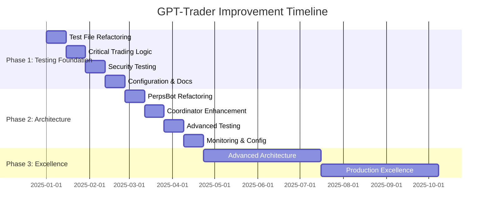
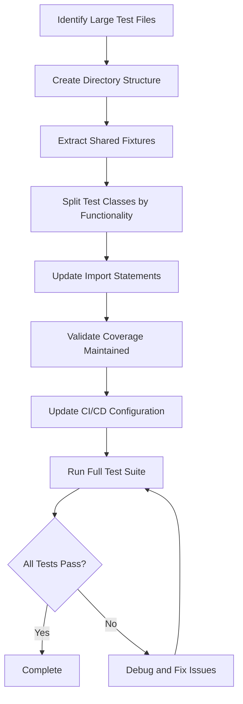
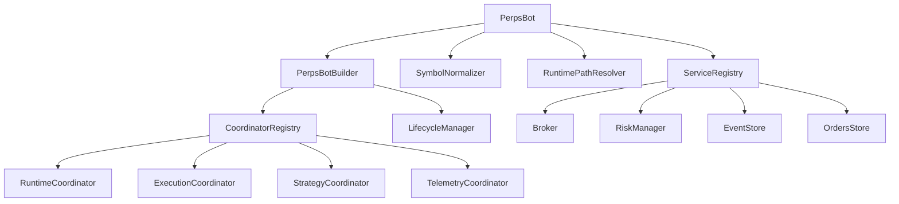

# GPT-Trader Comprehensive Improvement Plan

## Executive Summary

This plan provides a prioritized roadmap for improving the GPT-Trader project based on comprehensive analyses of architecture, code organization, testing, configuration/deployment, and documentation. With a small team (2-3 developers) and testing improvements as the highest priority, this plan focuses on practical, high-impact improvements that can be implemented incrementally without disrupting ongoing development.

## Impact/Effort Prioritization Matrix

### High-Impact, Low-Effort (Quick Wins - Phase 1)
1. **Test file refactoring** - Break down large test files for better maintainability
2. **Coverage gap analysis** - Target critical trading logic testing gaps
3. **Configuration validation** - Enhance schema-driven configuration parsing
4. **Documentation validation** - Integrate doc checks in CI/CD
5. **Test organization improvements** - Restructure test directories for better navigation

### Medium-Impact, Medium-Effort (Strategic - Phase 2)
1. **PerpsBot refactoring** - Break down the 670-line monolith
2. **Coordinator pattern enhancement** - Improve dependency injection
3. **Security testing expansion** - Comprehensive auth and secrets testing
4. **Configuration drift detection** - Automated monitoring
5. **Documentation maintenance workflow** - Automated updates and validation

### High-Impact, High-Effort (Long-term - Phase 3)
1. **Advanced execution engine testing** - Complex market scenarios
2. **Property-based testing expansion** - Invariant testing across components
3. **Multi-exchange architecture preparation** - Extensible broker interfaces
4. **Performance optimization** - Memory and execution speed improvements
5. **Comprehensive monitoring integration** - Advanced observability

## Phased Roadmap

### Phase 1: Immediate Improvements (Months 1-3)
**Focus**: Testing infrastructure and quick architectural wins

#### Month 1: Testing Foundation
- **Week 1-2**: Test file refactoring (3,661 lines across 3 large files)
  - Refactor `test_telemetry.py` (1,286 lines → 4 files)
  - Refactor `test_strategy_orchestrator.py` (1,223 lines → 5 files)
  - Refactor `test_execution_coordinator.py` (1,152 lines → 3 files)
- **Week 3-4**: Critical trading logic testing
  - Advanced execution engine core methods coverage
  - Risk management critical paths testing
  - Liquidity service edge cases

#### Month 2: Coverage Enhancement
- **Week 5-6**: Security testing foundation
  - Auth handler comprehensive test suite
  - Secrets manager robust testing
  - Security validator edge cases
- **Week 7-8**: Integration testing expansion
  - End-to-end trading workflows
  - Cross-component integration scenarios
  - Error recovery testing

#### Month 3: Configuration & Documentation
- **Week 9-10**: Configuration improvements
  - Schema-driven configuration validation
  - Environment-specific configuration testing
  - Configuration drift detection setup
- **Week 11-12**: Documentation validation
  - CI/CD integration for documentation checks
  - Automated documentation generation
  - Trust-aware documentation maintenance

### Phase 2: Strategic Enhancements (Months 4-6)
**Focus**: Architectural improvements and advanced testing

#### Month 4: Architecture Refactoring
- **Week 13-14**: PerpsBot refactoring
  - Extract symbol normalization logic
  - Separate filesystem setup concerns
  - Improve dependency injection
- **Week 15-16**: Coordinator pattern enhancement
  - Improve lifecycle management
  - Enhance context passing
  - Simplify coordinator registration

#### Month 5: Advanced Testing
- **Week 17-18**: Property-based testing
  - Trading logic invariants
  - Security property tests
  - Risk management invariants
- **Week 19-20**: Performance and stress testing
  - Market condition edge cases
  - System stress scenarios
  - Resource exhaustion handling

#### Month 6: Monitoring & Configuration
- **Week 21-22**: Advanced monitoring
  - Configuration drift detection automation
  - Runtime guard enhancement
  - Metrics collection improvements
- **Week 23-24**: Configuration management
  - Backup automation
  - Configuration validation automation
  - Environment-specific optimizations

### Phase 3: Long-term Evolution (Months 7-12)
**Focus**: Scalability and advanced features

#### Months 7-9: Advanced Architecture
- Multi-exchange support preparation
- Distributed execution patterns
- Advanced order types implementation
- Portfolio-level risk management

#### Months 10-12: Production Excellence
- Real-time ML adaptation
- Cross-exchange arbitrage foundation
- Options integration preparation
- Institutional feature framework

## Detailed Task Breakdown

### 1. Testing Improvements (Highest Priority)

#### 1.1 Test File Refactoring (Phase 1)
**Target Files**:
- `test_telemetry.py` (1,286 lines → 4 files, ~305 lines avg)
- `test_strategy_orchestrator.py` (1,223 lines → 5 files, ~245 lines avg)
- `test_execution_coordinator.py` (1,152 lines → 3 files, ~384 lines avg)

**Benefits**:
- 3x faster parallel test execution
- Easier test navigation and maintenance
- Reduced merge conflicts
- Better CI/CD feedback

**Implementation Steps**:
1. Create directory structures with shared conftest.py files
2. Extract test classes by functionality
3. Move fixtures to shared conftest.py
4. Update import statements
5. Validate coverage is maintained
6. Update CI/CD configuration

#### 1.2 Critical Trading Logic Testing (Phase 1)
**Advanced Execution Engine** (`advanced_execution.py`):
- `place_order()` method comprehensive testing
- `calculate_impact_aware_size()` market impact calculations
- `cancel_and_replace()` order modification workflows
- Error handling paths for broker failures

**Risk Management Core** (`risk/manager.py`):
- Runtime state transitions under stress
- Cross-symbol risk aggregation
- Daily P&L tracking and limit enforcement
- Reduce-only mode activation logic

**Liquidity Service** (`liquidity_service.py`):
- Real-time order book analysis under stress
- Market impact estimation accuracy
- Liquidity condition determination logic
- Edge cases with sparse market data

#### 1.3 Security Testing Expansion (Phase 1-2)
**Auth Handler** (`auth_handler.py`):
- Token refresh under expiration scenarios
- MFA setup and verification flows
- Permission checking edge cases
- Session management under concurrency

**Secrets Manager** (`secrets_manager.py`):
- Key rotation workflows
- Vault integration failure scenarios
- Cache consistency under concurrent access
- Encryption/decryption edge cases

### 2. Architectural Improvements

#### 2.1 PerpsBot Refactoring (Phase 2)
**Current Issues**:
- 670-line monolithic constructor
- Mixed responsibilities (environment parsing, storage, dependency creation)
- Difficult to test and extend

**Refactoring Plan**:
1. Extract `PerpsBotBuilder` class for construction logic
2. Separate `SymbolNormalizer` for symbol processing
3. Create `RuntimePathResolver` for filesystem setup
4. Improve dependency injection for testing
5. Reduce constructor to ≤50 lines

**Expected Outcome**:
- Improved testability
- Better separation of concerns
- Easier dependency injection
- Cleaner initialization flow

#### 2.2 Coordinator Pattern Enhancement (Phase 2)
**Current State**: Good foundation with room for improvement

**Enhancements**:
1. Improve lifecycle management error handling
2. Enhance context passing efficiency
3. Simplify coordinator registration process
4. Add coordinator health monitoring
5. Improve error propagation

### 3. Configuration and Deployment Improvements

#### 3.1 Configuration Validation (Phase 1)
**Current State**: Partially implemented for risk configuration

**Expansion Plan**:
1. Extend schema-driven approach to all configuration surfaces
2. Add environment-specific validation rules
3. Implement configuration drift detection
4. Create configuration backup automation
5. Add configuration validation to CI/CD

#### 3.2 Configuration Drift Detection (Phase 2)
**Implementation**:
1. Automated baseline snapshot comparison
2. Runtime configuration monitoring
3. Alert system for unauthorized changes
4. Automated rollback capabilities
5. Configuration change audit trail

### 4. Documentation and Knowledge Sharing

#### 4.1 Documentation Validation (Phase 1)
**Implementation**:
1. CI/CD integration for documentation checks
2. Automated link validation
3. Code example verification
4. Documentation coverage reporting
5. Trust-aware documentation maintenance

#### 4.2 Documentation Maintenance Workflow (Phase 2)
**Automation**:
1. API documentation generation from code
2. Architecture diagram updates from code changes
3. Test documentation generation
4. Change log automation
5. Documentation review process integration

## Success Metrics and KPIs

### Testing Metrics
- **Coverage Percentage**: 72.87% → 80% (Phase 1), 90% (Phase 3)
- **Critical Path Coverage**: 95% for trading and risk components
- **Test Execution Time**: <5 minutes for full suite (3x improvement)
- **Test Flakiness Rate**: <1% failure rate
- **Test File Size**: Average <400 lines (from 1,150+ lines)

### Architecture Metrics
- **Cyclomatic Complexity**: Reduce PerpsBot from 670 lines to ≤50 lines in constructor
- **Dependency Coupling**: Improve testability through dependency injection
- **Code Duplication**: <5% duplication across components
- **Module Size**: Average <500 lines per module

### Configuration Metrics
- **Configuration Validation**: 100% schema coverage
- **Drift Detection**: <5 minute detection time
- **Configuration Recovery**: <1 minute rollback time
- **Environment Parity**: 100% configuration consistency

### Documentation Metrics
- **Documentation Coverage**: 90% of public APIs documented
- **Documentation Accuracy**: 95% accuracy rate
- **Documentation Freshness**: <7 days stale threshold
- **Trust Score**: Maintain high trust scores in verification matrix

## Implementation Approach

### Team Structure (2-3 Developers)
**Recommended Allocation**:
- **Developer 1**: Testing focus (primary priority)
- **Developer 2**: Architecture and configuration
- **Developer 3**: Documentation and cross-cutting concerns

### Risk Mitigation Strategies

#### Technical Risks
1. **Test Refactoring Risk**:
   - Mitigation: Incremental refactoring with coverage validation
   - Rollback plan: Git-based rollback with test validation

2. **Architecture Refactoring Risk**:
   - Mitigation: Feature flags and gradual migration
   - Rollback plan: Facade pattern for backward compatibility

3. **Configuration Changes Risk**:
   - Mitigation: Schema validation and backward compatibility
   - Rollback plan: Configuration versioning and rollback

#### Process Risks
1. **Team Capacity Risk**:
   - Mitigation: Prioritized backlog and flexible scope
   - Contingency: Extend timeline or reduce scope

2. **Integration Risk**:
   - Mitigation: Comprehensive integration testing
   - Contingency: Staged rollout with monitoring

### Tools and Processes

#### Development Tools
- **Test Organization**: pytest with parallel execution
- **Coverage Monitoring**: pytest-cov with coverage reporting
- **Configuration Validation**: Pydantic schemas
- **Documentation**: Automated generation tools

#### CI/CD Enhancements
- **Test Parallelization**: pytest-xdist for faster execution
- **Coverage Gates**: Minimum coverage thresholds
- **Documentation Validation**: Automated checks
- **Configuration Validation**: Pre-deployment validation

#### Monitoring and Alerting
- **Test Execution Monitoring**: Execution time and failure rates
- **Coverage Tracking**: Trend analysis and alerting
- **Configuration Drift Detection**: Automated monitoring
- **Documentation Freshness**: Automated stale content detection

## Mermaid Diagrams

### Implementation Timeline

### Test Refactoring Process

### PerpsBot Refactoring Architecture

## Conclusion

This comprehensive improvement plan provides a practical, prioritized roadmap for enhancing the GPT-Trader project. With a focus on testing improvements as the highest priority, the plan balances immediate needs with long-term architectural goals.

The phased approach allows for incremental improvements without disrupting ongoing development, while the success metrics provide clear targets for measuring progress. The implementation approach is tailored for a small team, with realistic timelines and risk mitigation strategies.

By following this plan, the team can achieve significant improvements in code quality, testability, maintainability, and overall system reliability while maintaining the flexibility to adapt to changing business needs.

**Next Steps**:
1. Review and approve this plan with the team
2. Assign specific tasks to team members
3. Set up tracking and monitoring for success metrics
4. Begin Phase 1 implementation with testing improvements
5. Regular review and adjustment of the plan based on progress and learnings
